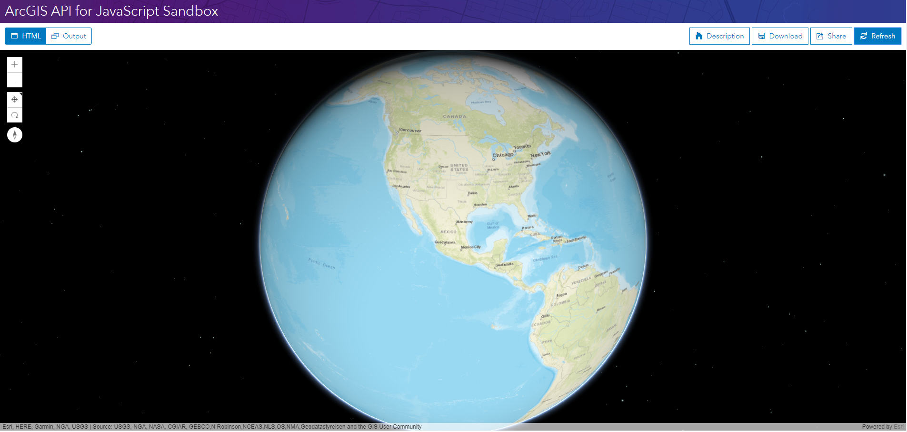

[//]: # (自定义一点样式)
<style>
html body blockquote{
    border-left:4px solid #009A61;
}

html body img{
    box-shadow: 0px 0px 10px 3px #000;
}
</style>

# SceneView 简介 - 创建三维地图（翻译 Intro to SceneView - Create a 3D map）
> 这是一篇英文翻译，原文：https://developers.arcgis.com/javascript/latest/sample-code/intro-sceneview/index.html

这个教程将带领你创建一个简单的三维地图。

1. 引用 ArcGIS API for JS
建立一个基本的 HTML 文档。
```html
<!DOCTYPE html>
<html>
<head>
<meta charset="utf-8">
<meta name="viewport" content="initial-scale=1, maximum-scale=1, user-scalable=no">
<title>SceneView 简介 - 创建三维地图</title>
</head>
</html>
```
在 `<head>` 标签内，使用 `<script>` 和 `<link>` 引用 ArcGIS API for JS 。
```html
<link rel="stylesheet" href="https://js.arcgis.com/4.5/esri/css/main.css">
<script src="https://js.arcgis.com/4.5/"></script>
```
2. 加载模块
再使用一个 `<script>` 标签来从 API 加载指定的模块。这个程序需要加载模块有：
- `esri/Map` : 加载创建地图的模块。
- `esri/views/SceneView` : 加载创建三维视图的代码。
- `dojo/domReady!` : 用于确保在执行代码之前 DOM 已经准备好。

> 感叹号表示 domReady 是一个 AMD 加载器插件。除了 `dojo/domReady` , Dojo 还提供了 `dojo/ready` 。区别是前者需等到 DOM 可用才调用回调函数，后者等待 DOM 准备好，等待所有请求调用完成。更多关于 `dodo/ready` 的信息请查看 [Dojo documentation for dojo/ready](http://dojotoolkit.org/reference-guide/1.10/dojo/ready.html) 。 在简单的情况下，应该使用 `dojo/domReady！`。如果应用程序使用 `parseOnLoad：true`，`Dojo Dijits`，Esri库中的小部件或自定义dijits，则应使用 `dojo/ready`。

```html
<script>
require([
  "esri/Map",
  "esri/views/SceneView",
  "dojo/domReady!"
], function(Map, SceneView) {
  // 创建地图的代码卸载这里
</script>
```

> 在构建简单的网页或者做实验时，将 JavaScript 代码放到 script 标签中是非常合适的。但是当构建大型的应用程序时，JavaScript 代码应该放在在一些单独的 .js 文件中。

全局函数 `require()` （由 Dojo 提供）用于加载模块。为了充分利用 Dojo 的模块化代码库和跨浏览器差异的能力，Esri 的 JavaScript API 构建于 Dojo 的基础之上。如果想了解更多关于 Dojo 和 JavaScript API 之间的关系，可以查看 [Working with Dojo](https://developers.arcgis.com/javascript/jshelp/inside_dojo.html) 和 [Why Dojo](https://developers.arcgis.com/javascript/jshelp/why_dojo.html)。

3. 创建地图
创建地图使用 `Map` ,`Map` 是 Map 类（从 `esri/Map` 加载的模块）的引用。 通过传递一个对象给 Map 构造函数可以设定地图属性，例如 `basemap`。

```javascript
require([
  "esri/Map",
  "esri/views/SceneView",
  "dojo/domReady!"
], function(Map, SceneView) {
  var map = new Map({
    basemap: "streets",
    ground: "world-elevation"
  });
});
```

`basemap` 选项的值还可以是：`satellite`、`hybrid`、`topo`、`dark-gray`、`oceans`、`osm`、`national-geographic`。可以在[沙箱](https://developers.arcgis.com/javascript/latest/sample-code/sandbox/index.html?sample=intro-mapview) 中试着修改 `basemap`。可以查看 [Map class](https://developers.arcgis.com/javascript/latest/api-reference/esri-Map.html) 以了解其他地图选项的详细信息。

`ground` 属性指定了三维地图的地面，只有将地图添加到三维场景中这个属性才有意义。字符串 `world-elevation` 指定了使用世界高程服务（the World Elevation Service）提供地表数据。

4. 创建三维视图
视图（View 对象）需要引用节点来呈现地图。
创建一个 `SceneView` 并通过构造函数的参数设置它的属性。

```javascript
require([
  "esri/Map",
  "esri/views/SceneView",
  "dojo/domReady!"
], function(Map, SceneView) {
  var map = new Map({
    basemap: "streets",
    ground: "world-elevation"
  });
  var view = new SceneView({
    container: "viewDiv",  // \引用 DOM 节点，该节点将用来容纳视图
    map: map  // 引用了上一步创建的 map 
  });
});
```

在这个代码片段中，`container` 属性被设置为用于显示地图的 DOM 节点的名称。`map` 属性引用了第 3 步创建的地图对象。如果想为 `view` 设置更多属性（例如 `center`、`scale`， 他们将会设置视图的初始范围），可以参考 [SceneView documentation](https://developers.arcgis.com/javascript/latest/api-reference/esri-views-SceneView.html)。

> 有两种视图：MapView(用于创建二维地图) 和 SceneView(用于创建三维地图)。如果想了解更多关于创建三维地图的知识，可以查看[Intro to MapView](https://developers.arcgis.com/javascript/latest/sample-code/intro-mapview/index.html)。

5. 编写网页内容
创建地图和视图的 JavaScript 都已经编写完成了！接下来要做的是添加一些和查看地图相关的 HTML 代码。对于这个例子，HTML 代码很简单：添加一个 `body` 标签（定义在浏览器中可以看到内容）和一个 `div` 元素（用于显示创建的地图）。
```html
<body>
  <div id="viewDiv"></div>
</body>
```

这里的 `div` 的 id 和传递给 SceneView 的构造函数的 `container` 属性的值一样。

6. 设置网页样式
这里使用 `<head>` 内的 `<style>` 标签来设置网页内容样式。为了使地图充满整个浏览器窗口，需在 `<style>` 中添加下列 CSS 代码。
```html
<style>
  html, body, #viewDiv {
    padding: 0;
    margin: 0;
    height: 100%;
    width: 100%;
  }
</style>
```
到此，应用程序已经编写完。完整的代码如下：
```html
<!DOCTYPE html>
<html>
<head>
<meta charset="utf-8">
<meta name="viewport" content="initial-scale=1, maximum-scale=1, user-scalable=no">
<title>Intro to SceneView - Create a 3D map</title>
<style>
  html, body, #viewDiv {
    padding: 0;
    margin: 0;
    height: 100%;
    width: 100%;
  }
</style>
<link rel="stylesheet" href="https://js.arcgis.com/4.5/esri/css/main.css">
<script src="https://js.arcgis.com/4.5/"></script>
<script>
require([
  "esri/Map",
  "esri/views/SceneView",
  "dojo/domReady!"
], function(Map, SceneView){
  var map = new Map({
    basemap: "streets",
    ground: "world-elevation"
  });
  var view = new SceneView({
    container: "viewDiv",     // 引用第 5 步创建的 DOM 节点
    map: map,                 // 引用 map 对象
    scale: 50000000,          // 设置初始比例尺为 1:50,000,000
    center: [-101.17, 21.78]  // 使用经纬度设置视图中心
  });
});
</script>
</head>
<body>
  <div id="viewDiv"></div>
</body>
</html>
```

在[沙箱](https://developers.arcgis.com/javascript/latest/sample-code/sandbox/index.html?sample=intro-sceneview)的执行效果如下：



（完）

<footer style="background:#000;color:white;border-radius:5px;padding:5px;">
  对我来说，这是翻译，也是学习笔记，主要是为了学习。如果有哪里不对并希望帮助我改进，可邮件：hgy9473@foxmail.com
</footer>
