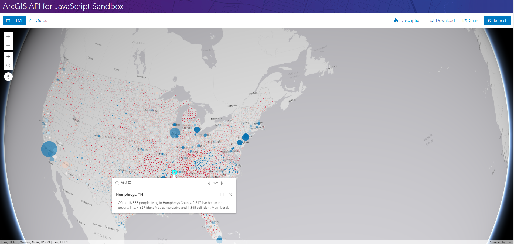

# 使用 portal item 创建一个图层

> 这是一篇英文翻译。原文：https://developers.arcgis.com/javascript/latest/sample-code/layers-portal/index.html

[portal item](https://developers.arcgis.com/javascript/latest/api-reference/esri-portal-PortalItem.html) 是 Portal 中的一个内容单元，每个 item 有一个唯一的标识符和URL。每一个 item 可能具有一些文本或二进制的数据。可查看 ArcGIS Portal API REST 文档了解更多关于 [item](http://resources.arcgis.com/en/help/arcgis-rest-api/index.html#//02r3000000mt000000) 的细节。

这个示例程序的将制作一张描绘美国各县的贫困与政治倾向的的地图。

在这个示例中，我们将根据一个托管在 ArcGIS Online 的 portal item 创建一个图层并添加到三维地图。当 portal item 加载成为一个图层时，[渲染器](https://developers.arcgis.com/javascript/latest/api-reference/esri-renderers-Renderer.html)和存在于图层中[弹窗模板](https://developers.arcgis.com/javascript/latest/api-reference/esri-PopupTemplate.html)会应用到程序中。

加载来自 portal item 的图层必须使用 ID 。
```javascript
// 使用 portal item 创建一个图层
Layer.fromPortalItem({
  portalItem: {
    id: "af1ad38816814b7eba3fe74a3b84412d"
  }
}).then(function(lyr){
  // Adds layer to the map
  map.add(lyr);
});
```

### 最终效果

完整的代码如下：

```html
<!DOCTYPE html>
<html>
<head>
  <meta charset="utf-8">
  <meta name="viewport" content="initial-scale=1,maximum-scale=1,user-scalable=no">
  <title>使用 portal item 创建一个图层</title>

  <style>
    html,
    body,
    #viewDiv {
      padding: 0;
      margin: 0;
      height: 100%;
      width: 100%;
      overflow: hidden;
    }
  </style>

  <link rel="stylesheet" href="https://js.arcgis.com/4.5/esri/css/main.css">

  <script src="https://js.arcgis.com/4.5/"></script>

  <script>
    require([
      "esri/Map",
      "esri/views/SceneView",
      "esri/layers/Layer",
      "dojo/domReady!"
    ], function(
      Map, SceneView, Layer
    ) {

      var map = new Map({
        basemap: "gray"
      });

      var view = new SceneView({
        map: map,
        container: "viewDiv",
        zoom: 7,
        center: [-87, 34]
      });

      /************************************************
       *
       * 使用托管在 ArcGIS Online 的 portal item 创建一个图层
       *
       *************************************************/
      Layer.fromPortalItem({
          portalItem: {
            id: "8444e275037549c1acab02d2626daaee"
          }
        }).then(addLayer)
        .otherwise(rejection);

      // 当图层加载完成时添加到地图
      function addLayer(lyr) {
        map.add(lyr);
      }

      function rejection(err) {
        console.log("Layer failed to load: ", err);
      }
    });
  </script>
</head>

<body>
  <div id="viewDiv"></div>
</body>

</html>
```
在[沙箱](https://developers.arcgis.com/javascript/latest/sample-code/sandbox/index.html?sample=layers-portal)中运行程序的效果如下图：




---
[//]: # (内嵌 html)
<footer style="background:#000;color:white;border-radius:5px;padding:5px;">
  对我来说，这是翻译，也是学习笔记，主要是为了学习。文章难免出错，所以会不定期持续修改，转载请注明出处，以便有缘人能看到最新最合适的版本。如果有哪里不对并希望帮助我改进，可邮件：hgy9473@foxmail.com
</footer>