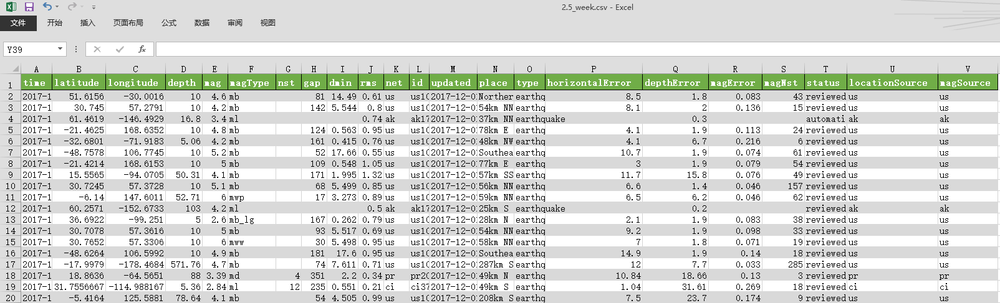
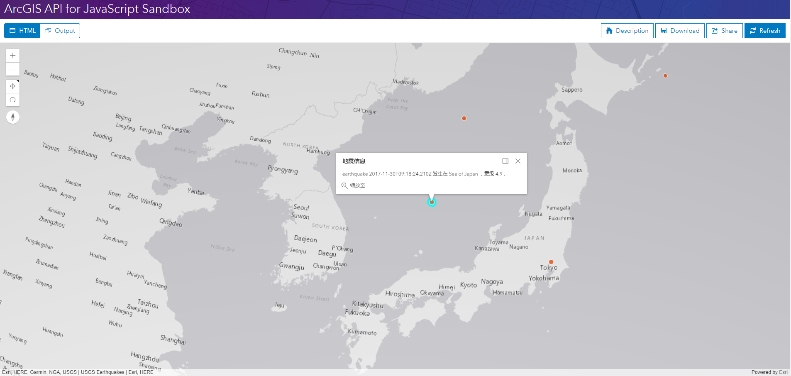

# CSVLayer

> 这是一篇英文翻译。原文：https://developers.arcgis.com/javascript/latest/sample-code/layers-csv/index.html

[CSVLayer](https://developers.arcgis.com/javascript/latest/api-reference/esri-layers-CSVLayer.html) 允许你从包含经纬度信息的逗号分隔文件（.csv）或有分隔符的文本文件（.txt）添加要素。这个文件至少要包含一对坐标字段，这些字段被用来表示要素在地图上的位置。

这个示例显示了如何添加 CSVLayer 到地图。获取到的点可以通过 API 来查询，也可以作为其它操作的输入。

> 如果 csv 文件和你的网站不在同一个域，则需要启用 CORS 的服务器或者代理服务器。

这个示例访问了来自 [USGS](https://www.usgs.gov/products/data-and-tools/real-time-data/earthquakes) 的实时数据。USGS 站点启用了 CORS，我们所需要做的是 `push` 服务器名称到 `corsEnabledServers` 。

> USGS 是 United States Geological Survey 的缩写，意思是美国地质调查局。

```javascript
var url = "https://earthquake.usgs.gov/earthquakes/feed/v1.0/summary/2.5_week.csv";
esriConfig.request.corsEnabledServers.push(url);
```

csv文件内容



### 最终效果

完整的代码如下：
```html
<!DOCTYPE html>
<html>

<head>
  <meta charset="utf-8">
  <meta name="viewport" content="initial-scale=1,maximum-scale=1,user-scalable=no">
  <title>CSVLayer - 4.5</title>

  <style>
    html,
    body,
    #viewDiv {
      padding: 0;
      margin: 0;
      height: 100%;
      width: 100%;
    }
  </style>

  <link rel="stylesheet" href="https://js.arcgis.com/4.5/esri/css/main.css">
  <script src="https://js.arcgis.com/4.5/"></script>

  <script>
    require([
      "esri/Map",
      "esri/layers/CSVLayer",
      "esri/views/SceneView",
      "esri/config",
      "esri/core/urlUtils",
      "dojo/domReady!"
    ], function(
      Map,
      CSVLayer,
      SceneView,
      esriConfig,
      urlUtils
    ) {

      // 如果 csv 文件和你的网站不在同一个域，则需要启用 CORS 的服务器或者代理服务器。
      var url =
        "https://earthquake.usgs.gov/earthquakes/feed/v1.0/summary/2.5_week.csv";
      esriConfig.request.corsEnabledServers.push(url);

      // 把这个 url 粘贴到浏览器地址栏可以下载 csv 文件查看里面的属性信息
      // csv 文件的属性信息包括：
      // * mag - 地震级数
      // * type - 地震或者其他事件（如核试验）
      // * place - 事件位置
      // * time - 事件发生时间

      var template = {
        title: "地震信息",
        content: "  {type} {time} 发生在 {place} ，震级 {mag} ."
      };

      var csvLayer = new CSVLayer({
        url: url,
        copyright: "USGS Earthquakes",
        popupTemplate: template,
        elevationInfo: {
          mode: "on-the-ground"
        }
      });

      csvLayer.renderer = {
        type: "simple", 
        symbol: {
          type: "point-3d", 
          symbolLayers: [{
            type: "icon",
            material: {
              color: [238, 69, 0, 0.75]
            },
            outline: {
              width: 0.5,
              color: "white"
            },
            size: "12px"
          }]
        }
      };

      var map = new Map({
        basemap: "gray",
        layers: [csvLayer]
      });

      var view = new SceneView({
        container: "viewDiv",
        center: [138, 35],
        zoom: 4,
        map: map
      });

    });
  </script>
</head>

<body>
  <div id="viewDiv"></div>
</body>

</html>
```


在[沙箱](https://developers.arcgis.com/javascript/latest/sample-code/sandbox/index.html?sample=layers-csv)中运行程序的效果如下图：




---
[//]: # (内嵌 html)
<footer style="background:#000;color:white;border-radius:5px;padding:5px;">
  对我来说，这是翻译，也是学习笔记，主要是为了学习。文章难免出错，所以会不定期持续修改，转载请注明出处，以便有缘人能看到最新最合适的版本。如果有哪里不对并希望帮助我改进，可邮件：hgy9473@foxmail.com
</footer>