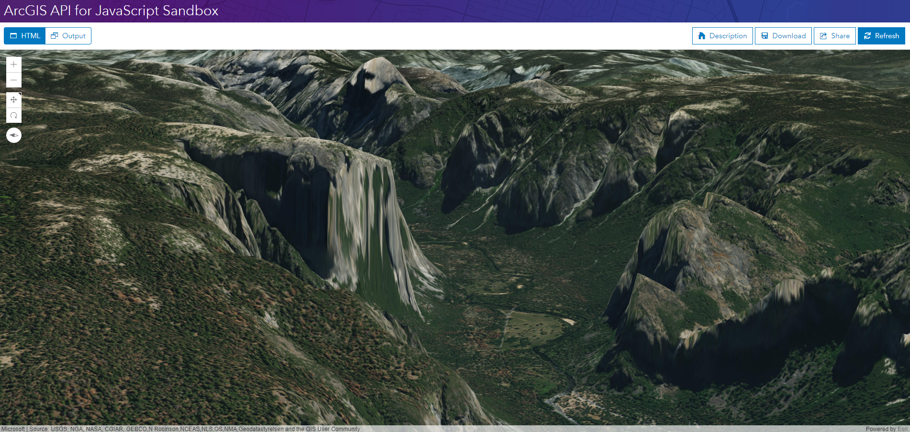

# IntegratedMeshLayer

> 这是一篇英文翻译。原文：https://developers.arcgis.com/javascript/latest/sample-code/layers-integratedmeshlayer/index.html


[IntegratedMeshLayer](https://developers.arcgis.com/javascript/latest/api-reference/esri-layers-IntegratedMeshLayer.html) 是为了精确表示基础设施和自然景观而设计的。

这个示例显示了如何将 IntegratedMeshLayer 添加到地图。

integrated mesh 能使用真实的材质和高程信息来表达建筑和自然三维要素（如建筑墙面、树木、山谷和悬崖）。

integrated mesh 通常用于城市范围的三维制图，可以使用 [Drone2Map for ArcGIS](http://www.esri.com/products/drone2map) 创建，可以共享到 ArcGIS for Desktop 和 Web 应用程序。 

### 最终效果

完整的代码如下：
```html
<!DOCTYPE html>
<html>
<head>
  <meta charset="utf-8">
  <meta name="viewport" content="initial-scale=1,maximum-scale=1,user-scalable=no">
  <title>IntegratedMeshLayer</title>

  <link rel="stylesheet" href="https://js.arcgis.com/4.5/esri/css/main.css">
  <script src="https://js.arcgis.com/4.5/"></script>

  <style>
    html,
    body,
    #viewDiv {
      padding: 0;
      margin: 0;
      height: 100%;
      width: 100%;
    }
  </style>

  <script>
    require([
        "esri/Map",
        "esri/views/SceneView",
        "esri/layers/IntegratedMeshLayer",
        "dojo/domReady!"
      ],
      function(
        Map, SceneView,
        IntegratedMeshLayer
      ) {

        /********************
         * 创建 IntegratedMeshLayer 图层
         ********************/

        var layer = new IntegratedMeshLayer({
          url: "https://tiles.arcgis.com/tiles/FQD0rKU8X5sAQfh8/arcgis/rest/services/VRICON_Yosemite_Sample_Integrated_Mesh_scene_layer/SceneServer"
        });

        /**************************
         * 添加 IntegratedMeshLayer 到地图
         *************************/

        var map = new Map({
          basemap: "satellite",
          layers: [layer],
          ground: "world-elevation"
        });

        var view = new SceneView({
          container: "viewDiv",
          map: map,
          camera: {
            position: {
              x: -13314225,
              y: 4543000,
              z: 1446,
              spatialReference: {
                wkid: 3857
              }
            },
            tilt: 84,
            heading: 85
          }
        });

      });
  </script>
</head>

<body>
  <div id="viewDiv"></div>
</body>

</html>
```


在[沙箱](https://developers.arcgis.com/javascript/latest/sample-code/sandbox/index.html?sample=layers-integratedmeshlayer)中运行程序的效果如下图：




---
[//]: # (内嵌 html)
<footer style="background:#000;color:white;border-radius:5px;padding:5px;">
  对我来说，这是翻译，也是学习笔记，主要是为了学习。文章难免出错，所以会不定期持续修改，转载请注明出处，以便有缘人能看到最新最合适的版本。如果有哪里不对并希望帮助我改进，可邮件：hgy9473@foxmail.com
</footer>