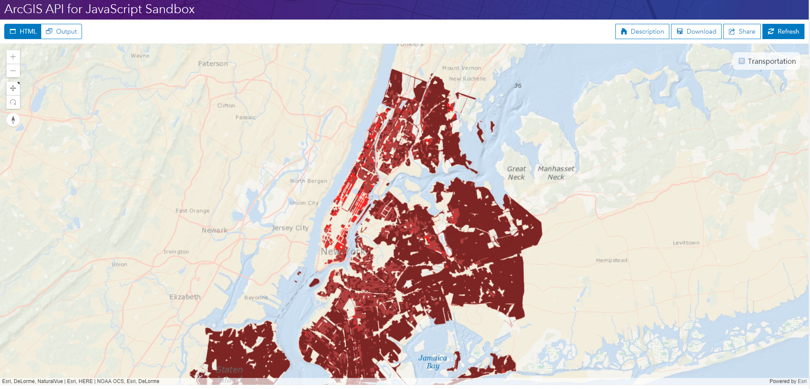

# 图层简介（翻译 Intro to layers）
> 这是一篇英文翻译，原文：https://developers.arcgis.com/javascript/latest/sample-code/intro-layers/index.html


图层是地图最基本的组成部分。图层是以图形或影像表示现实世界的空间数据的集合。在矢量数据中，图层包含很多离散的要素，而在栅格数据中图层包含很多连续的单元/像素。

地图可能包含不同类型的图层。有关 API 中可用的图层类型，请查阅关于 [Layer 类型的描述](https://developers.arcgis.com/javascript/latest/api-reference/esri-layers-Layer.html#layer-types)。

所有的图层类型都继承了 Layer 类的属性、方法、事件。本教程会讨论一些常用的属性。想了解更多关于不同图层的属性，可以在[这里](https://developers.arcgis.com/javascript/latest/sample-code/intro-layers/index.html?search=*layer) 搜索示范程序（如：输入 SceneLayer,单击搜索）。

在查看下列步骤之前，你应该对 [View](https://developers.arcgis.com/javascript/latest/api-reference/esri-views-View.html) 和 [Map](https://developers.arcgis.com/javascript/latest/api-reference/esri-Map.html) 熟悉。建议先查看以下教程：

- [Intro to MapView](Intro-to-MapView-Create-a-2D-map.md)
- [Intro to SceneView](Intro-to-SceneView-Create-a-3D-map.md)

### 1. 创建地图、场景和复选框

创建地图和场景的 JS 代码如下：

```javascript
require([
  "esri/Map",
  "esri/views/SceneView",
  "dojo/domReady!"
], function(
  Map,
  SceneView
) {

  // 创建地图
  var map = new Map({
    basemap: "oceans"
  });

  // 创建场景
  var view = new SceneView({
      container: "viewDiv",
      map: map
  });
});
```

创建复选框的代码如下。关于目的下文会讨论到。

```html
<body>
  <div id="viewDiv"></div>
  <span id="layerToggle">
    <input type="checkbox" id="streetsLyr" checked> Transportation
  </span>
</body>
```

### 2. 使用 TileLayer 创建两个图层

在创建 map 和 view 之前，应当创建两个 [TileLayer](https://developers.arcgis.com/javascript/latest/api-reference/esri-layers-TileLayer.html) 的实例。。创建 TileLayer 的实例需要加载 `esri/TileLayer` 模块并为实例指定 [url](https://developers.arcgis.com/javascript/latest/api-reference/esri-layers-TileLayer.html#url) 属性值。`url` 属性值必须指向一个地图缓存服务（托管在 ArcGIS Server 或者 Portal for ArcGIS）。

在这个例子中，我们为街道和高速公路分别创建了图层。

```javascript
require([
    "esri/Map",
    "esri/views/SceneView",
    "esri/layers/TileLayer",  // Require the TileLayer module
    "dojo/domReady!"
  ],
  function(
    Map, SceneView, TileLayer
  ) {

    var transportationLyr = new TileLayer({
      url: "https://server.arcgisonline.com/ArcGIS/rest/services/Reference/World_Transportation/MapServer"
    });

    var housingLyr = new TileLayer({
      url: "https://tiles.arcgis.com/tiles/nGt4QxSblgDfeJn9/arcgis/rest/services/New_York_Housing_Density/MapServer"
    });

    /*****************************************************************
    * 前面的步骤创建 map 和 view 的代码应该放在这里
    *****************************************************************/
});
```

### 3. 在图层中设置其它属性

你可以在图层上设置其它属性，例如 [id](https://developers.arcgis.com/javascript/latest/api-reference/esri-layers-Layer.html#id) 、 [minScale](https://developers.arcgis.com/javascript/latest/api-reference/esri-layers-Layer.html#minScale) 、 [maxScale](https://developers.arcgis.com/javascript/latest/api-reference/esri-layers-Layer.html#maxScale) 、 [opacity](https://developers.arcgis.com/javascript/latest/api-reference/esri-layers-Layer.html#opacity) 、 [visible](https://developers.arcgis.com/javascript/latest/api-reference/esri-layers-Layer.html#visible) 。可以在构造函数中设置，也可以在程序中的其它位置设置。

```javascript
var transportationLyr = new TileLayer({
  url: "https://server.arcgisonline.com/ArcGIS/rest/services/Reference/World_Transportation/MapServer",
  id: "streets",
  opacity: 0.7
});

var housingLyr = new TileLayer({
  url: "https://tiles.arcgis.com/tiles/nGt4QxSblgDfeJn9/arcgis/rest/services/New_York_Housing_Density/MapServer",
  id: "ny-housing"
});
```

`id` 唯一标识图层，使得我们可以在程序其他的其它引用图层。如果开发者没有设置，id 会自动生成。

### 4. 添加图层到地图

图层可以通过多种方式添加到地图中。关于添加图层方式，可查看 [Map.layers](https://developers.arcgis.com/javascript/latest/api-reference/esri-Map.html#layers) 。在这个例子中，我们使用不同的方式来添加图层。

使用构造函数添加图层：
```javascript
// 创建图层的代码在此之前
var map = new Map({
  basemap: "oceans",
  layers: [housingLyr]  // 使用构造函数添加图层
});
```

使用 [map.layers.add()](https://developers.arcgis.com/javascript/latest/api-reference/esri-Map.html#add) 添加图层：
```javascript
map.layers.add(transportationLyr);
```

### 5. 处理图层的可见性。

加载 `dojo/on` 和 `dojo/dom` 模块以实现监听第 1 步创建的复选框的改变事件。当复选框选中状态变化的时候通过设置 `layer` 的 `visible` 属性值切换图层的可见性。[layer](https://developers.arcgis.com/javascript/latest/api-reference/esri-layers-Layer.html) 中的其它属性也可以通过 layer（ Layer 实例）直接设置。

```javascript
require([
    "esri/Map",
    "esri/views/SceneView",
    "esri/layers/TileLayer",
    "dojo/dom",  // 访问 DOM 节点需要这个模块
    "dojo/on",   // 监听 DOM 事件需要这个模块
    "dojo/domReady!"
  ],
  function(
    Map, SceneView, TileLayer, dom, on
  ) {

    /*****************************************************************
     * 前几步写的代码应该在这里，此处省略一下
     *******************************************************************/

    // 创建一个变量引用 DOM 节点
    var streetsLyrToggle = dom.byId("streetsLyr");

    // 监听复选框的 change 事件
    on(streetsLyrToggle, "change", function(){
      // 根据复选框的值改变 visible 属性值
      transportationLyr.visible = streetsLyrToggle.checked;
    });
  });
```
在这个例子中，不可见的图层也是地图的一部分。所以，你仍然可以访问它的属性并使用它们进行分析。

### 6. 了解 LayerViews

[Layer](https://developers.arcgis.com/javascript/latest/api-reference/esri-layers-Layer.html) 对象管理着发布为服务的地理数据和表格数据。在[视图](https://developers.arcgis.com/javascript/latest/api-reference/esri-views-View.html) 中任何渲染数据它不管，这是 [LayerView](https://developers.arcgis.com/javascript/latest/api-reference/esri-views-layers-LayerView.html) 要做的事。 在图层渲染之前，它的 LayerView 将会被创建。当使用 [FeatureLayer](https://developers.arcgis.com/javascript/latest/api-reference/esri-layers-FeatureLayer.html)，与其相关的 [FeatureLayerView] 使得开发者可以访问已经在视图中完成渲染的图层数据。

在这一步，我们将监听 [layerview-create](https://developers.arcgis.com/javascript/latest/api-reference/esri-views-View.html#event:layerview-create) 事件并打印相关信息，你可以在控制台浏览这些信息。我们使用了 id 来获取想要的图层。除了地图的可操作图层之外，这个事件还涉及底图图层和高程图层。

```javascript
require([
    "esri/Map",
    "esri/views/SceneView",
    "esri/layers/TileLayer",
    "dojo/dom",
    "dojo/on",
    "dojo/domReady!"
  ],
  function(
    Map, SceneView, TileLayer, dom, on
  ) {

    /*****************************************************************
     * 前几步写的代码应该在这里，此处省略一下
     *******************************************************************/

    // 每当图层的 LayerView 创建的时候，这个事件就会被触发
    view.on("layerview-create", function(event) {
      if (event.layer.id === "ny-housing") {
        // 打印信息
        console.log("id 为 'ny-housing' 的图层的 LayerView 创建了!", event.layerView);
      }
      if (event.layer.id === "streets") {
        // 打印信息
        console.log("id 为 'streets' 的图层的 LayerView 创建了!", event.layerView);
      }
    });

  });
```

### 7. 使用 Layer.then()

图层是一个 [promise](https://developers.arcgis.com/javascript/latest/guide/working-with-promises/index.html) ，图层[加载完成](https://developers.arcgis.com/javascript/latest/api-reference/esri-layers-Layer.html#loaded)或者图层所有属性都可用的时候，图层变为 resolve 状态。

在这里我们想实现设置图层[全幅显示](https://developers.arcgis.com/javascript/latest/api-reference/esri-layers-Layer.html#fullExtent)。但是在图层加载完成之前，我们获取不到它的 `fullExtent` 属性。所以我们必须等到图层对象变为 resolve 状态。这里调用 [then()](https://developers.arcgis.com/javascript/latest/api-reference/esri-layers-Layer.html#then) 来实现。

```javascript
// 当图层变为 resolve 状态时，切换到全幅
housingLyr.then(function() {
  view.goTo(housingLyr.fullExtent);
});
``` 

### 8. 最终效果

完整代码如下：
```html
<!DOCTYPE html>
<html>
<head>
  <meta charset="utf-8">
  <meta name="viewport" content="initial-scale=1,maximum-scale=1,user-scalable=no">
  <title>Intro to layers - 4.5</title>

  <link rel="stylesheet" href="https://js.arcgis.com/4.5/esri/css/main.css">
  <script src="https://js.arcgis.com/4.5/"></script>

  <style>
    html,
    body,
    #viewDiv {
      padding: 0;
      margin: 0;
      height: 100%;
      width: 100%;
    }

    #layerToggle {
      top: 20px;
      right: 20px;
      position: absolute;
      z-index: 99;
      background-color: white;
      border-radius: 8px;
      padding: 10px;
      opacity: 0.75;
    }
  </style>

  <script>
    require([
        "esri/Map",
        "esri/views/SceneView",
        "esri/layers/TileLayer",
        "dojo/dom",
        "dojo/on",
        "dojo/domReady!"
      ],
      function(
        Map, SceneView, TileLayer, dom, on
      ) {

        /*****************************************************************
         * 创建两个 TileLayer 图层
         *****************************************************************/
        var transportationLyr = new TileLayer({
          url: "https://server.arcgisonline.com/ArcGIS/rest/services/Reference/World_Transportation/MapServer",
          // This property can be used to uniquely identify the layer
          id: "streets",
          visible: false
        });

        var housingLyr = new TileLayer({
          url: "https://tiles.arcgis.com/tiles/nGt4QxSblgDfeJn9/arcgis/rest/services/New_York_Housing_Density/MapServer",
          id: "ny-housing",
          opacity: 0.9
        });

        /*****************************************************************
         * 使用构造函数添加图层
         *****************************************************************/
        var map = new Map({
          basemap: "oceans",
          layers: [housingLyr]
        });

        /*****************************************************************
         * 使用 map.add() 添加图层
         *****************************************************************/
        map.add(transportationLyr);

        var view = new SceneView({
          container: "viewDiv",
          map: map
        });

        /*****************************************************************
         * 当 layerview 创建的时候输出信息
         *****************************************************************/
        view.on("layerview-create", function(event) {
          if (event.layer.id === "ny-housing") {
            console.log("id 为 'ny-hosing' 的图层的 LayerView 创建完成!", event.layerView);
          }
          if (event.layer.id === "streets") {
            console.log("id 为 'streets' 的图层的 LayerView 创建完成!", event.layerView);
          }
        });

        /*****************************************************************
         * 当图层加载完时设置视图范围显示图层全幅
         *****************************************************************/
        view.then(function() {
          housingLyr.then(function() {
            view.goTo(housingLyr.fullExtent);
          });
        });

        var streetsLyrToggle = dom.byId("streetsLyr");

        /*****************************************************************
         * 监听复选框的 change 事件，根据复选框值的变化切换图层可见性
         *******************************************************************/
        on(streetsLyrToggle, "change", function() {
          transportationLyr.visible = streetsLyrToggle.checked;
        });
      });
  </script>
</head>

<body>
  <div id="viewDiv"></div>
  <span id="layerToggle">
    <input type="checkbox" id="streetsLyr"> Transportation
  </span>
</body>

</html>
```

在[沙箱](https://developers.arcgis.com/javascript/latest/sample-code/sandbox/index.html?sample=intro-layers)中的执行效果如下：



---
[//]: # (内嵌 html)
<footer style="background:#000;color:white;border-radius:5px;padding:5px;">
  对我来说，这是翻译，也是学习笔记，主要是为了学习。文章难免出错，所以会不定期持续修改，转载请注明出处，以便有缘人能看到最新最合适的版本。如果有哪里不对并希望帮助我改进，可邮件：hgy9473@foxmail.com
</footer>