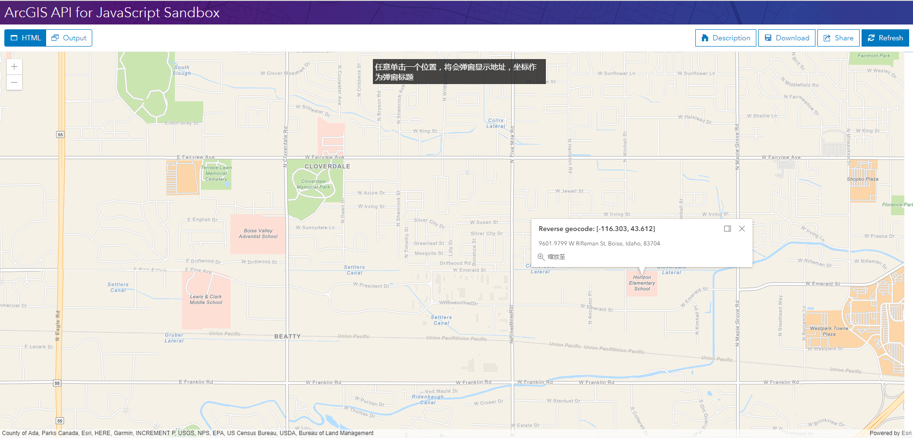

# 弹窗简介（翻译 Intro to popups）

通过显示信息来响应用户行为，[Popups](https://developers.arcgis.com/javascript/latest/api-reference/esri-widgets-Popup.html) 提供了一种给 ArcGIS JS 应用增加交互性的简易方式。

每个 [view](https://developers.arcgis.com/javascript/latest/api-reference/esri-views-View.html) 有一个 [popup](https://developers.arcgis.com/javascript/latest/api-reference/esri-views-View.html#popup) 与之关联。大多数情况下，[popup 的内容](https://developers.arcgis.com/javascript/latest/api-reference/esri-widgets-Popup.html#content) 可来自[图层](https://developers.arcgis.com/javascript/latest/api-reference/esri-layers-Layer.html)和[图形](https://developers.arcgis.com/javascript/latest/api-reference/esri-Graphic.html)的属性数据。

虽然弹窗通常与图形图层或要素图层一起使用，但是你也可以使用弹窗来响应查询或其他与图形和要素无关的操作。例如鼠标单击视图的时候弹窗显示经纬度。

这个示例将通过设置内容，标题和位置等属性来指导你在视图中使用默认的弹出窗口(https://developers.arcgis.com/javascript/latest/api-reference/esri-widgets-Popup.html)，并在不从 [PopupTemplate](https://developers.arcgis.com/javascript/latest/api-reference/esri-PopupTemplate.html)，[图形](https://developers.arcgis.com/javascript/latest/api-reference/esri-Graphic.html)或[图层要素](https://developers.arcgis.com/javascript/latest/api-reference/esri-widgets-Popup.html#features)中提取信息的情况下显示它。

这个示例使用 [Locator task](https://developers.arcgis.com/javascript/latest/api-reference/esri-tasks-Locator.html) 来对单击位置的坐标进行反向地理编码。返回的地址显示在弹窗的内容区域，经纬度作为弹出标题。

在查看下列步骤之前，你应该对 [View](https://developers.arcgis.com/javascript/latest/api-reference/esri-views-View.html) 和 [Map](https://developers.arcgis.com/javascript/latest/api-reference/esri-Map.html) 熟悉。建议先查看以下教程：

- [Intro to MapView](Intro-to-MapView-Create-a-2D-map.md)
- [Intro to SceneView](Intro-to-SceneView-Create-a-3D-map.md)

### 1. 加载 Locator 、 Map 和 MapView 模块并创建他们的实例

创建 [Locator](https://developers.arcgis.com/javascript/latest/api-reference/esri-tasks-Locator.html) 需要使用[世界地理编码服务](https://geocode.arcgis.com/arcgis/index.html) 。

创建地图并添加到视图。

```javascript
 require([
    "esri/tasks/Locator",
    "esri/Map",
    "esri/views/MapView",
    "dojo/domReady!"
  ], function(
     Locator,
     Map,
     MapView
   ) {

    // 创建 Locator 实例
    var locatorTask = new Locator({
       url: "https://geocode.arcgis.com/arcgis/rest/services/World/GeocodeServer"
    });

    // 创建地图
    var map = new Map({
       basemap: "streets"
    });

    // 创建视图
    var view = new MapView({
        container: "viewDiv",
        map: map,
        center: [-116.3031, 43.6088],
        zoom: 12
    });
 });
```

### 2. 监听视图的单击事件并在单击的位置弹出窗口

监听[视图的单击事件](https://developers.arcgis.com/javascript/latest/api-reference/esri-views-MapView.html#event:click)并获取单击位置的经纬度。在单击的位置显示弹窗，并将位置坐标作为窗口标题。为了实现这些，我们需要在 [open() 方法](https://developers.arcgis.com/javascript/latest/api-reference/esri-widgets-Popup.html#open)中设置弹窗的标题和位置。

```javascript
 view.on("click", function(event) {
    event.stopPropagation();

    // 获取单击位置的坐标，精确到三位小数并四舍五入。
    var lat = Math.round(event.mapPoint.latitude * 1000) / 1000;
    var lon = Math.round(event.mapPoint.longitude * 1000) / 1000;

    view.popup.open({
        // 将坐标设置为弹窗标题
        title: "Reverse geocode: [" + lon + ", " + lat + "]",
        location: event.mapPoint // 设置弹窗位置
    });
});
```

### 3. 获取单击位置的地址并将其显示在弹窗的内容区域

当用户在视图上单击的时候，调用 [locatorTask.locationToAddress()](https://developers.arcgis.com/javascript/latest/api-reference/esri-tasks-Locator.html#locationToAddress) 并传入单击的点位。如果获取到了和点位匹配的地址，则将地址显示在弹窗中，如果没有则显示文字说明。

```javascript
// 使用单击的点位执行反向地理编码
locatorTask.locationToAddress(event.mapPoint).then(function(response) {
  // 获取到地址时显示在弹窗中
  view.popup.content = response.address;
}).otherwise(function(err) {
  // 没有获取到地址时显示文字说明
  view.popup.content = "没有找到匹配这个位置的地址";
});
```

### 4. 最终效果

完整的代码如下：

```html
<!DOCTYPE html>
<html>
<head>
  <meta charset="utf-8">
  <meta name="viewport" content="initial-scale=1,maximum-scale=1,user-scalable=no">
  <title>Intro to popups - 4.5</title>

  <style>
    html,
    body,
    #viewDiv {
      padding: 0;
      margin: 0;
      height: 100%;
      width: 100%;
    }

    #instruction {
      z-index: 99;
      position: absolute;
      top: 15px;
      left: 50%;
      padding: 5px;
      margin-left: -175px;
      width: 350px;
      background: rgba(25, 25, 25, 0.8);
      color: white;
    }
  </style>

  <link rel="stylesheet" href="https://js.arcgis.com/4.5/esri/css/main.css">
  <script src="https://js.arcgis.com/4.5/"></script>

  <script>
    require([
      "esri/tasks/Locator",
      "esri/Map",
      "esri/views/MapView",
      "dojo/domReady!"
    ], function(
      Locator,
      Map,
      MapView
    ) {

      // 创建 Locator 实例
      var locatorTask = new Locator({
        url: "https://geocode.arcgis.com/arcgis/rest/services/World/GeocodeServer"
      });

      var map = new Map({
        basemap: "streets-navigation-vector"
      });

      var view = new MapView({
        container: "viewDiv",
        map: map,
        center: [-116.3031, 43.6088],
        zoom: 12
      });

      /*******************************************************************
       * 单击的时候弹出默认弹窗
       *******************************************************************/
      view.on("click", function(event) {
        event.stopPropagation(); // 重写默认的弹窗行为

        // 获取单击点坐标
        var lat = Math.round(event.mapPoint.latitude * 1000) / 1000;
        var lon = Math.round(event.mapPoint.longitude * 1000) / 1000;

        view.popup.open({
          // 设置弹窗标题
          title: "Reverse geocode: [" + lon + ", " + lat + "]",
          location: event.mapPoint //设置弹窗位置
        });

        // 执行反向地理编码
        locatorTask.locationToAddress(event.mapPoint).then(function(
          response) {
          // 获取到地址时
          view.popup.content = response.address;
        }).otherwise(function(err) {
          // 未获取到地址时
          view.popup.content =
            "没有找到匹配这个位置的地址";
        });
      });
    });
  </script>
</head>

<body>
  <div id="viewDiv"></div>
  <div id="instruction">任意单击一个位置，将会弹窗显示地址，坐标作为弹窗标题</div>
</body>

</html>
```

在[沙箱](https://developers.arcgis.com/javascript/latest/sample-code/sandbox/index.html?sample=intro-popup)中执行程序的效果如下：



---
[//]: # (内嵌 html)
<footer style="background:#000;color:white;border-radius:5px;padding:5px;">
  对我来说，这是翻译，也是学习笔记，主要是为了学习。文章难免出错，所以会不定期持续修改，转载请注明出处，以便有缘人能看到最新最合适的版本。如果有哪里不对并希望帮助我改进，可邮件：hgy9473@foxmail.com
</footer>