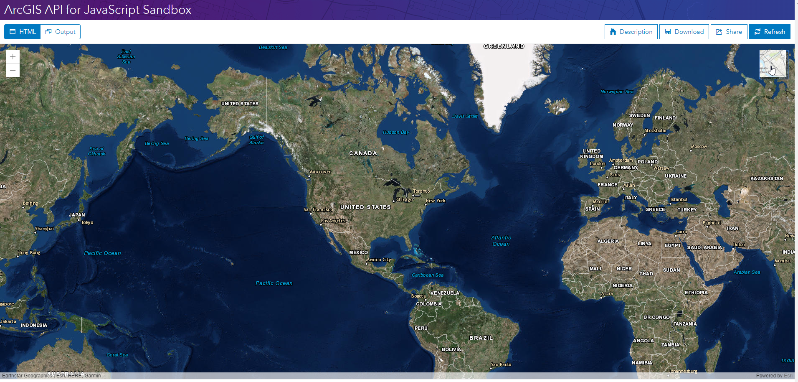

# 小部件简介 - 使用 Bsemap Toggle（翻译：Intro to widgets using BasemapToggle）

> 这是一篇英文翻译。原文：https://developers.arcgis.com/javascript/latest/sample-code/intro-widgets/index.html


小部件（widgets）是 ArcGIS API for JS 的一个重要组成部分。通常来说，小部件被认为是封装了特定功能的一小块 API 。该 API 提供具有预定义功能的即用型小部件。一些小部件如下：

- [Locate](https://developers.arcgis.com/javascript/latest/api-reference/esri-widgets-Locate.html) : 在地图中定位你的当前位置。

- [Legend](https://developers.arcgis.com/javascript/latest/api-reference/esri-widgets-Legend.html) : 用于给地图添加图例。

- [LayerList](https://developers.arcgis.com/javascript/latest/api-reference/esri-widgets-LayerList.html) : 用于显示图层列表，提供开关图层功能。

- [Search](https://developers.arcgis.com/javascript/latest/api-reference/esri-widgets-Search.html) : 搜索地图上的要素和坐标。

点[这里](https://developers.arcgis.com/javascript/latest/api-reference/#modules-in-esri-widgets)查看所有可用的小部件。

有些小部件默认对 MapView 和 SceneView 可用，有些则需要手动添加到程序。例如 [Zoom](https://developers.arcgis.com/javascript/latest/api-reference/esri-widgets-Zoom.html) 小部件默认是视图的一部分，不需要手动添加。有些小部件对所有程序都有用，所以默认可用。而有些小部件只对特殊程序有用，所以需要手动添加。

使用小部件的步骤如下：

1. 创建并初始化小部件。
2. 设置小部件属性。

这个教程将指导你添加 [BasemapToggle](https://developers.arcgis.com/javascript/latest/api-reference/esri-widgets-BasemapToggle.html) 小部件到 MapView。这个小部件允许你在视图中切换底图。

在查看下列步骤之前，你应该对 [View](https://developers.arcgis.com/javascript/latest/api-reference/esri-views-View.html) 和 [Map](https://developers.arcgis.com/javascript/latest/api-reference/esri-Map.html) 熟悉。建议先查看以下教程：

- [Intro to MapView](Intro-to-MapView-Create-a-2D-map.md)
- [Intro to SceneView](Intro-to-SceneView-Create-a-3D-map.md)

> 虽然本教程介绍了如何在二维地图中使用 Basemap Toggle小部件，但同样的前提也适用于三维地图。

关于所有小部件的样式信息，可点[这里](https://developers.arcgis.com/javascript/latest/guide/styling/index.html)查看。

### 1.创建简单的地图并设置 MapView 
```javascript
require([
  "esri/Map",
  "esri/views/MapView",
  "esri/widgets/BasemapToggle",
  "dojo/domReady!"
], function(
  Map,
  MapView,
  BasemapToggle
) {

  // 创建一个带有底图的地图
  var map = new Map({
    basemap: "topo"
  });

  // 创建一个 MapView 并引用 map
  var view = new MapView({
    container: "viewDiv",
    map: map,
    center: [-86.049, 38.485],
    zoom: 3
  });
});
```

### 2. 创建 BasemapToggle 小部件并设置其属性。

创建 `BasemapToggle` 小部件的实例，并设置它的 `view` 和 `nextBaseMap` 属性。

`view` 属性值可设置为 MapView 或 SceneView 的实例。

`nextBasemap` 属性设置用于切换的底图。这个属性的取值可以是字符串（ Esri 提供的底图）和自定义的 Basemap 对象。

```javascript
var view = new MapView({
  container: "viewDiv",
  map: map,
  center: [-86.049, 38.485],
  zoom: 3
});

// 1 - 创建小部件
var toggle = new BasemapToggle({
  // 2 - 设置属性
  view: view,
  nextBasemap: "hybrid" 
});
```

### 3. 添加小部件到视图中

我们需要指定小部件在程序界面中的位置。在这里我们需要用到 [View 的UI 属性](https://developers.arcgis.com/javascript/latest/api-reference/esri-views-View.html#ui)。这个属性暴露了默认可用的小部件并允许你启用或禁用它们。除此之外，可以用它指定小部件的位置。这个 UI 属性继承自 [DefaultUI](https://developers.arcgis.com/javascript/latest/api-reference/esri-views-ui-DefaultUI.html) 。这个类提供了添加、移动、移除小部件的方法。在这里我们把 BasemapToggle 小部件添加到右上角。

```javascript
// 添加小部件到右上角
view.ui.add(toggle, "top-right");
```

### 4. 最终效果

完整的代码如下：

```html
<!DOCTYPE html>
<html>
<head>
  <meta charset="utf-8">
  <meta name="viewport" content="initial-scale=1,maximum-scale=1,user-scalable=no">
  <title>Intro to widgets using BasemapToggle - 4.5</title>

  <link rel="stylesheet" href="https://js.arcgis.com/4.5/esri/css/main.css">
  <script src="https://js.arcgis.com/4.5/"></script>

  <style>
    html,
    body,
    #viewDiv {
      padding: 0;
      margin: 0;
      height: 100%;
      width: 100%;
    }
  </style>

  <script>
    require([
        "esri/Map",
        "esri/views/MapView",
        "esri/widgets/BasemapToggle",
        "dojo/domReady!"
      ],
      function(Map, MapView, BasemapToggle) {

        // 创建带有底图的地图
        var map = new Map({
          basemap: "topo"
        });

        // 创建 MapView 实例并引用 map
        var view = new MapView({
          container: "viewDiv",
          map: map,
          center: [-86.049, 38.485],
          zoom: 3
        });

        // 1 - 创建小部件
        var toggle = new BasemapToggle({
          // 2 - 设置属性
          view: view,
          nextBasemap: "hybrid"
        });

        // 添加小部件到右上角
        view.ui.add(toggle, "top-right");
      });
  </script>
</head>
<body>
  <div id="viewDiv"></div>
</body>
</html>
```

在[沙箱](https://developers.arcgis.com/javascript/latest/sample-code/sandbox/index.html?sample=intro-widgets)中的运行效果如下：




---
[//]: # (内嵌 html)
<footer style="background:#000;color:white;border-radius:5px;padding:5px;">
  对我来说，这是翻译，也是学习笔记，主要是为了学习。文章难免出错，所以会不定期持续修改，转载请注明出处，以便有缘人能看到最新最合适的版本。如果有哪里不对并希望帮助我改进，可邮件：hgy9473@foxmail.com
</footer>