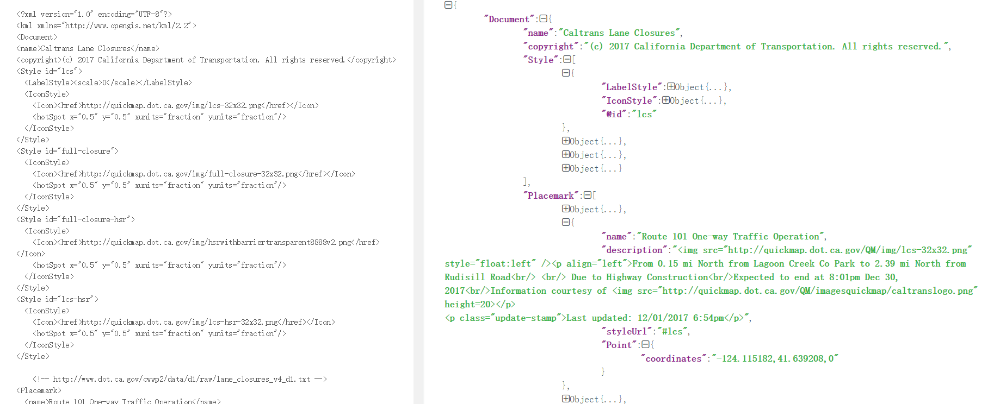
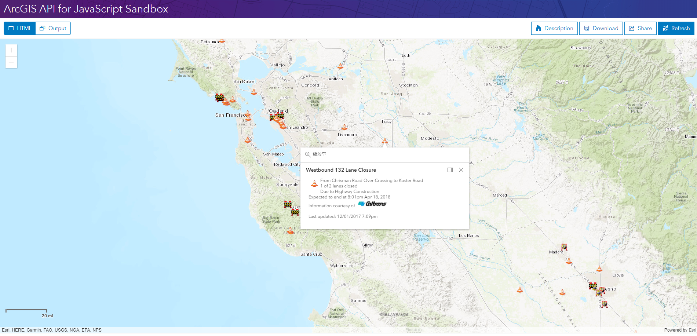

# KML 图层

> 这是一篇英文翻译。原文：https://developers.arcgis.com/javascript/latest/sample-code/layers-kml/index.html

KMLLayer 类用于创建基于 KML 文件（.kml 、 .kmz）的图层。KML 是一种用于表示地理要素的基于 XML 的文件。


这个示例显示如何使用 [KMLLayer](https://developers.arcgis.com/javascript/latest/api-reference/esri-layers-KMLLayer.html) 访问 KML 数据。

KML 文件数据结构如下：



### 最终效果

完整的代码如下：
```html
<!DOCTYPE html>
<html>

<head>
  <meta charset="utf-8">
  <meta name="viewport" content="initial-scale=1,maximum-scale=1,user-scalable=no">
  <title>KMLLayer - 4.5</title>

  <style>
    html,
    body,
    #viewDiv {
      padding: 0;
      margin: 0;
      height: 100%;
      width: 100%;
    }
  </style>

  <link rel="stylesheet" href="https://js.arcgis.com/4.5/esri/css/main.css">
  <script src="https://js.arcgis.com/4.5/"></script>

  <script>
    require([
      "esri/Map",
      "esri/views/MapView",
      "esri/layers/KMLLayer",
      "esri/widgets/ScaleBar",
      "dojo/domReady!"
    ], function(
      Map,
      MapView,
      KMLLayer,
      ScaleBar
    ) {

      var layer = new KMLLayer({
        url: "http://quickmap.dot.ca.gov/data/lcs.kml" 
      });

      var map = new Map({
        basemap: "topo",
        layers: [layer]
      });

      var view = new MapView({
        container: "viewDiv",
        map: map
      });

      // 添加比例尺并绑定到视图
      var scalebar = new ScaleBar({
        view: view
      });
      // 设置比例尺位置
      view.ui.add(scalebar, "bottom-left");

      
      layer.then(function() {
        // KML 图层加载完成后缩放到全幅
        layer.watch("fullExtent", function(fullExtent) {
          view.extent = fullExtent;
        });
      });
    });
  </script>

</head>

<body>
  <div id="viewDiv"></div>
</body>

</html>
```


在[沙箱](https://developers.arcgis.com/javascript/latest/sample-code/sandbox/index.html?sample=layers-kml)中运行程序的效果如下图：




---
[//]: # (内嵌 html)
<footer style="background:#000;color:white;border-radius:5px;padding:5px;">
  这是翻译，也是学习笔记，翻译带有个人色彩，请谨慎阅读。文章难免出错，所以会不定期持续修改，转载请注明出处，以便有缘人能看到最新最合适的版本。如果有哪里不对并希望帮助我改进，可邮件：hgy9473@foxmail.com
</footer>