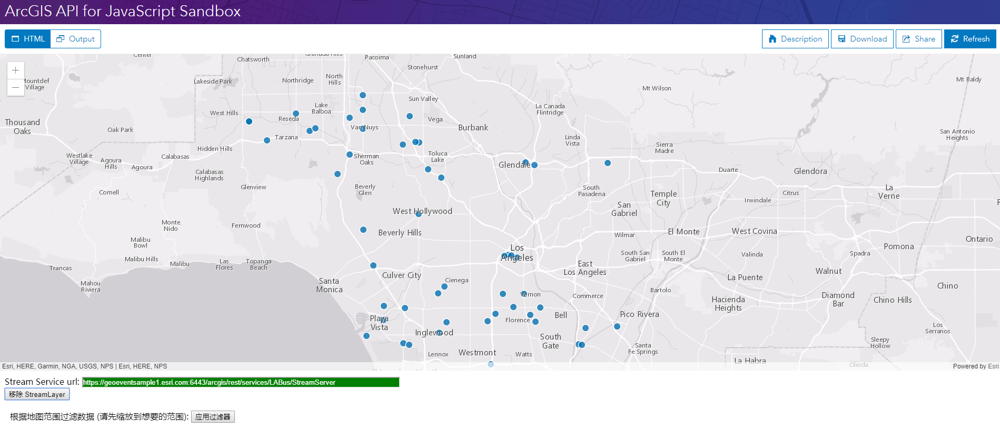

# StreamLayer

> 这是一篇英文翻译。原文：

[StreamLayer](https://developers.arcgis.com/javascript/latest/api-reference/esri-layers-StreamLayer.html) 扩展了 FeatureLayer 以添加使用 HTML5 WebSockets 连接到数据流的能力。它将连接到一个不断向外发送数据的服务器。FeatureLayer 适用于对静态数据进行制图，而 StreamLayer 适用于对无限连续的动态数据进行制图。当 StreamLayer 连接到服务器以后，用户能够看到服务器推送的实时更新。

这个示例显示了如何添加 StreamLayer 到地图以及如何为图层设置空间过滤器。

这个示例中的 StreamLayer 表示了位于西雅图的虚拟公交车。这个是需要支持 [WebSockets](http://caniuse.com/#feat=websockets) 的浏览器。

在这个示例中用到了 ArcGIS for Server Stream Service 。关于如何发布流数据请参考 [GeoEvent Processor](https://server.arcgis.com/en/geoevent-extension/latest/get-started/what-is-arcgis-geoevent-extension-for-server.htm) 。

### 最终效果

完整的代码如下：
```html
<!DOCTYPE html>
<html>
<head>
  <meta charset="utf-8">
  <meta name="viewport" content="initial-scale=1, maximum-scale=1,user-scalable=no">
  <title>StreamLayer - 4.5</title>
  <style>
    html,
    body {
      height: 100%;
      width: 100%;
      margin: 0;
      padding: 0;
    }

    body {
      background-color: #fff;
      overflow: hidden;
      font-family: sans-serif;
    }

    .controls {
      margin-left: 10px;
      padding-top: 10px;
      padding-bottom: 10px;
    }

    #viewDiv {
      height: 75%;
      width: 100%;
    }
  </style>
  <link rel="stylesheet" href="https://js.arcgis.com/4.5/esri/css/main.css">
  <script src="https://js.arcgis.com/4.5"></script>
  <script>
    require([
      "esri/Map",
      "esri/views/MapView",
      "esri/layers/StreamLayer",
      "esri/layers/GraphicsLayer",

      "esri/geometry/Polygon",
      "esri/Graphic",

      "dojo/on",
      "dojo/dom",
      "dojo/domReady!"
    ], function(Map, MapView, StreamLayer, GraphicsLayer,
      Polygon, Graphic,
      on, dom) {

      var streamLayer,
        streamLayerView;

      /***************************************
       * 创建地图并添加到视图，设置视图的初始范围
       ***************************************/
      var map = new Map({
        basemap: "gray"
      });

      var mapView = new MapView({
        container: "viewDiv",
        map: map,
        center: [-117.98118, 34.00679],
        zoom: 10
      });

// 添加图形图层
      var graphicsLayer = new GraphicsLayer();
      map.add(graphicsLayer);

      // 为按钮设置单击事件
      on(dom.byId("toggleStreamLayerButton"), "click", toggleStreamLayer);
      on(dom.byId("toggleSpatialFilterButton"), "click",
        toggleSpatialFilter);

      /*************************************************
       * 添加或移除 StreamLayer
       *************************************************/
      function toggleStreamLayer() {
        if (streamLayer) {
          removeStreamLayer();
        }
        else {
          addStreamLayer();
        }
      }

// 添加流图层
      function addStreamLayer() {
        // Stream Service 的 url
        var svcUrl = dom.byId("streamUrlText").value;

        // 创建 streamLayer
        streamLayer = new StreamLayer({
          url: svcUrl,
          purgeOptions: {
            displayCount: 10000
          }
        });

        map.add(streamLayer);


        // 当图形控制器创建完成时, 注册事件监听
        mapView.whenLayerView(streamLayer)
          .then(function(layerView) {
            streamLayerView = layerView;

// 监测流图层和服务器的连接情况
            layerView.watch("connectionStatus", function(value) {
              if (value === "connected") {
                processConnect();
              } else {
                processDisconnect();
              }
            });

            // 过滤器变化 事件
            streamLayer.watch("filter", processFilterChange);
          });
      }

      function removeStreamLayer() {
        if (streamLayer) {
          map.remove(streamLayer);
          streamLayer = null;
          graphicsLayer.removeAll();
          processDisconnect();
        }
      }

      /*********************************************************
       * StreamLayer 事件处理
       *********************************************************/
      function processConnect() {//连接成功时
        dom.byId("toggleStreamLayerButton").value = "移除 StreamLayer";
        dom.byId("streamUrlText").style.backgroundColor = "#008000";
        dom.byId("toggleSpatialFilterButton").value = "应用过滤器";
        dom.byId("divFilterControls").style.display = "block";
      }

      function processDisconnect() {
        dom.byId("toggleStreamLayerButton").value = "添加 StreamLayer";
        dom.byId("streamUrlText").style.backgroundColor = "#8b0000";
        dom.byId("divFilterControls").style.display = "none";
      }


      function processFilterChange(newFilter) {
        // 清除图形
        clearGraphics(streamLayerView);

        // The event contains a filter property that is the current filter set on the service
        // update map graphic to show current spatial filter
        var bbox = newFilter.geometry;

        graphicsLayer.removeAll();
        if (bbox) {
          graphicsLayer.add(new Graphic({
            geometry: Polygon.fromExtent(bbox),
            symbol: {
              type: "simple-fill", // autocasts as new SimpleFillSymbol()
              style: "none",
              outline: { // autocasts as new SimpleLineSymbol()
                color: [5, 112, 176],
                width: 2
              }
            }
          }));
        }
      }

      /************************************************
       *
       * 设置/清除空间过滤器的寒素
       *
       ************************************************/
      function toggleSpatialFilter() {
        var currentSpatialFilter = streamLayer && streamLayer.filter.geometry ?
          streamLayer.filter.geometry.clone() : null;

        if (!currentSpatialFilter) {
          // 设置控件过滤器为地图范围
          var extent = mapView.extent.expand(0.9);
          setSpatialFilter(extent);
          dom.byId("toggleSpatialFilterButton").value = "清除过滤器";
        }
        else {
          setSpatialFilter(null);
          dom.byId("toggleSpatialFilterButton").value = "应用过滤器";
        }
      }

      // 设置 streamLayer 的空间过滤器. 参数为 null 时清除过滤器
      function setSpatialFilter(bbox) {
        streamLayer.updateFilter({
          geometry: bbox
        });
      }

      // 清除图形
      function clearGraphics(layerView) {
        if (layerView) {
          layerView.graphics.removeAll();
        } else {
          console.log("函数没有接收到了无效参数");
          return;
        }
      }
    });
  </script>
</head>
<body>
  <div id="viewDiv"></div>
  <div class="controls">
    <span>Stream Service url: </span><input type="text" id="streamUrlText" value="https://geoeventsample1.esri.com:6443/arcgis/rest/services/LABus/StreamServer"
      style="color:#ffffff; width:600px; background-color: #8b0000" /><br>
    <input type="button" id="toggleStreamLayerButton" value="添加 Stream Layer" />
  </div>
  
  <div id="divFilterControls" class="controls" style="margin-left: 20px; display: none">
    <span>根据地图范围过滤数据 (请先缩放到想要的范围): </span>
    <input type="button" id="toggleSpatialFilterButton" value="应用过滤器" /><br>
  </div>
</body>
</html>
```


在[沙箱](https://developers.arcgis.com/javascript/latest/sample-code/sandbox/index.html?sample=layers-streamlayer)中运行程序的效果如下图：




---
[//]: # (内嵌 html)
<footer style="background:#000;color:white;border-radius:5px;padding:5px;">
  对我来说，这是翻译，也是学习笔记，主要是为了学习。文章难免出错，所以会不定期持续修改，转载请注明出处，以便有缘人能看到最新最合适的版本。如果有哪里不对并希望帮助我改进，可邮件：hgy9473@foxmail.com
</footer>