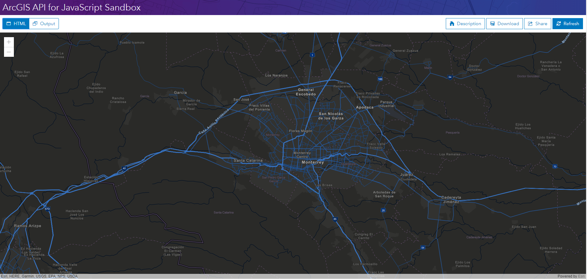

# VectorTileLayer

> 这是一篇英文翻译。原文：https://developers.arcgis.com/javascript/latest/sample-code/layers-vectortilelayer/index.html

这个示例显示了如何把 [VectorTileLayer](https://developers.arcgis.com/javascript/latest/api-reference/esri-layers-VectorTileLayer.html) 类型的图层添加到地图。这种图层能显示矢量格式的缓存数据，可以自定义图层样式。

VectorTileLayer 访问缓存的数据块并以矢量格式呈现，而不是图片，这是它的独特之处。

### 最终效果

完整的代码如下：
```html
<!DOCTYPE html>
<html>
<head>
  <meta charset="utf-8">
  <meta http-equiv="X-UA-Compatible" content="IE=Edge" />
  <meta name="viewport" content="initial-scale=1,maximum-scale=1,user-scalable=no"
  />
  <title>VectorTileLayer - 4.5</title>
  <style>
    html,
    body,
    #viewDiv {
      padding: 0;
      margin: 0;
      height: 100%;
      width: 100%;
    }
  </style>

  <link rel="stylesheet" href="https://js.arcgis.com/4.5/esri/css/main.css">
  <script src="https://js.arcgis.com/4.5/"></script>

  <script>
    require([
      "esri/Map",
      "esri/views/MapView",
      "esri/layers/VectorTileLayer",
      "dojo/domReady!"
    ], function(Map, MapView, VectorTileLayer) {

      // 创建地图
      var map = new Map();

      // 创建视图并绑定地图
      var view = new MapView({
        container: "viewDiv",
        map: map,
        center: [-100.33, 25.69],
        zoom: 10
      });

      /********************************************************************
       * 添加 VectorTileLayer 图层到地图
       *********************************************************************/
      var tileLyr = new VectorTileLayer({
        url: "https://www.arcgis.com/sharing/rest/content/items/92c551c9f07b4147846aae273e822714/resources/styles/root.json"
      });
      map.add(tileLyr);
    });
  </script>
</head>
<body>
  <div id="viewDiv"></div>
</body>
</html>
```


在[沙箱](https://developers.arcgis.com/javascript/latest/sample-code/sandbox/index.html?sample=layers-vectortilelayer)中运行程序的效果如下图：




---
[//]: # (内嵌 html)
<footer style="background:#000;color:white;border-radius:5px;padding:5px;">
  对我来说，这是翻译，也是学习笔记，主要是为了学习。文章难免出错，所以会不定期持续修改，转载请注明出处，以便有缘人能看到最新最合适的版本。如果有哪里不对并希望帮助我改进，可邮件：hgy9473@foxmail.com
</footer>