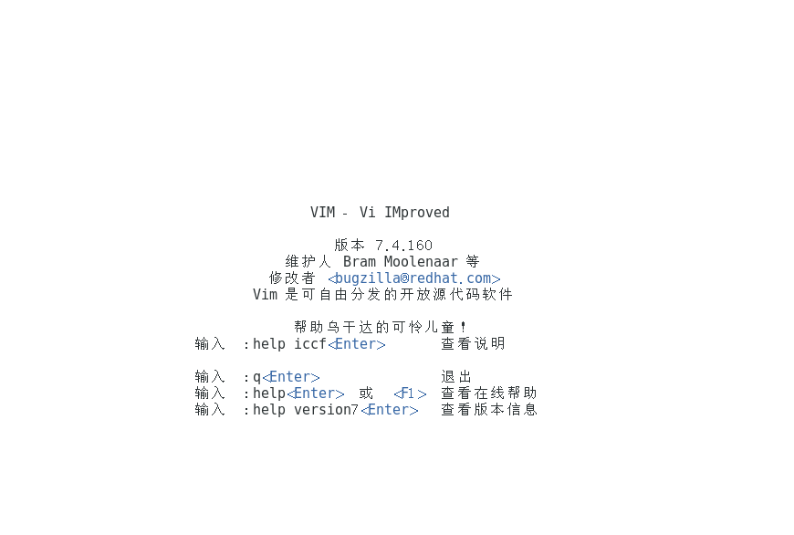
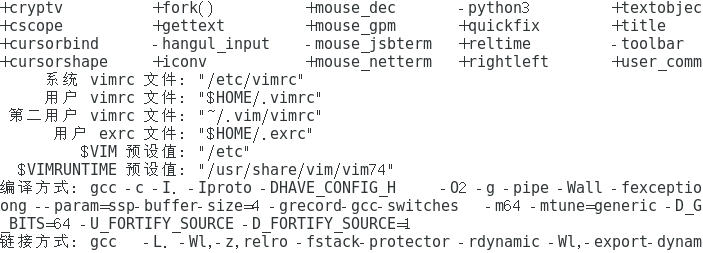

# CentOS 工具软件使用笔记 


## CentOS vi 使用笔记
---
> vi 是面向屏幕的文本编辑器，最初是为 Unix 操作系统创造的。
### 常用命令
```c
// 使用 vi 打开文件
$ vi a.js

// 退出 vi
// 退出 不保存
:q
// 退出 并保存
:wq

// 打开文件并修改
$ vi a.js
//进入插入模式，初次打开文件是命令行模式
i  
// 移动光标、增减字符

//  撤销
// 进入命令行模式
ESC
// 行撤销
U
// 撤销
u
// 回退
CTRL + R

```

### 配置
查看 vi 配置文件 vimrc
```c
// 进入vi
vi
```



```c
// 输入查看命令
:version
```



安装 Vundle （vi 插件管理工具）
> 参考 ： http://blog.leanote.com/post/yoanaky/centos6.8%E4%B8%8B%E5%AE%89%E8%A3%85Vundle%E6%8F%92%E4%BB%B6
```c
// 下载 Vundle
git clone https://github.com/VundleVim/Vundle.vim.git ~/.vim/bundle/Vundle.vim

// 修改配置文件 ~/.vimrc
// ~/.vimrc 文件不存在时可以新建 
// 参考下文完整配置文件，在配置文件中加上 
set rtp+=~/.vim/bundle/Vundle.vim

Plugin 'VundleVim/Vundle.vim'

// 进入 vi 
// 执行:PluginInstall
```

安装 emmet 插件
```vim
" 参考下文的完整配置代码
" 在 ~/.vimrc 中加入如下代码

Bundle 'mattn/emmet-vim'
" 设置展开快捷键 为 Ctrl+E
let g:user_emmet_expandabbr_key = '<C-E>'

```

### vi 完整配置代码
```vim
" file ~/.vimrc

" show row number
set nu

" color theme
colorscheme desert

" 设置encoding，防止乱码
set fileencodings=utf-8,gb2312,gb18030,gbk,ucs-bom,cp936,latin1

""""""""""""""""""""""""""""""
"     Vundle Setting         "
""""""""""""""""""""""""""""""
set nocompatible              " be iMproved, required
filetype on                  " required

" set the runtime path to include Vundle and initialize
set rtp+=~/.vim/bundle/Vundle.vim
call vundle#begin()

" let Vundle manage Vundle, required
Plugin 'VundleVim/Vundle.vim'

" emmet 插件
Bundle 'mattn/emmet-vim'
" 设置展开快捷键 为 Ctrl+E
let g:user_emmet_expandabbr_key = '<C-E>'
" let g:user_emmet_settings = {'indentation':' '}


" 插件管理核心库
Bundle 'gmarik/vundle'

" 文件管理器
Plugin 'scrooloose/nerdtree'
map <C-n> :NERDTreeToggle<CR>

" ctrlp搜索插件
Bundle 'ctrlpvim/ctrlp.vim'
let g:ctrlp_map = '<c-p>'
let g:ctrlp_cmd = 'CtrlP'

" 加强状态栏
Plugin 'bling/vim-airline'

"代码补全
Bundle 'Shougo/neocomplcache'
let g:neocomplcache_enable_at_startup = 1 

" Use smartcase.
let g:neocomplcache_enable_smart_case = 1

" Set minimum syntax keyword length.
let g:neocomplcache_min_syntax_length = 3
let g:neocomplcache_lock_buffer_name_pattern = '\*ku\*'
set completeopt-=preview

" EasyGrep
Plugin 'dkprice/vim-easygrep'

" 自动格式化
Plugin 'Chiel92/vim-autoformat'
noremap <F3> :Autoformat<CR>
let g:autoformat_autoindent = 1
let g:autoformat_retab = 1
let g:autoformat_remove_trailing_spaces = 1

" 自动补全括号，引号
Plugin 'Raimondi/delimitMate'
let g:delimitMate_expand_space = 1
let g:delimitMate_expand_cr = 2
let g:delimitMate_expand_space = 1

" 所有插件都应该在这行前面
call vundle#end()            " required

filetype plugin indent on    " required

" size of a hard tabstop
set tabstop=4

" size of an "indent"
set shiftwidth=4
```

## CentOS yum 使用笔记
---
> yum 是 rmp 系统的软件安装、更新、卸载工具。它会自动计算依赖关系并决定在安装的时候应该额外安装什么。它使得更新一组机器非常容易，不用手动使用 rpm 去更新每一台机器。
参考： http://yum.baseurl.org/

- 常用命令
```c
// 查看可安装软件清单
$ yum list

// 查看指定软件安装情况
$ yum list package-name

// 查看可更新软件
$ yum check-update

// 查看安装包信息
$ yum info package-name

// 安装软件
$ yum install package-name

// 查找软件包
$ yum search package-name

```

## CentOS pip 使用笔记
---
> pip 是一个包管理系统，用于安装和管理用 Python 写的软件包。

### 常用命令
```c
// 查看 pip 版本
pip -V

// 查看已安装的包
pip list

// 安装 django
pip install django==1.9

// 查看可更新的包
pip list --

// 查找包并查看已安装的版本
pip search package-name


```

## CentOS rpm 笔记
---
> RPM(Red Hat Package Manager) 是在 Linux 下广泛使用的软件包管理器。最早由 Red Hat 研制。 RPM 仅适用于安装用 RPM 来打包的软件。
常用命令
```c
// 查看已安装的软件
rpm -qa

// 查看指定软件信息
rpm -qa | grep firefox

```