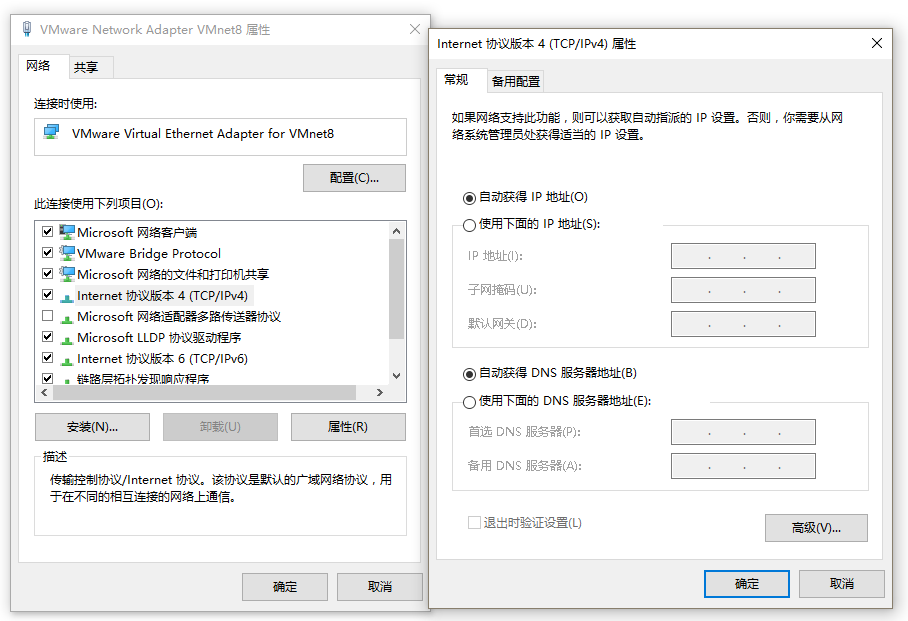
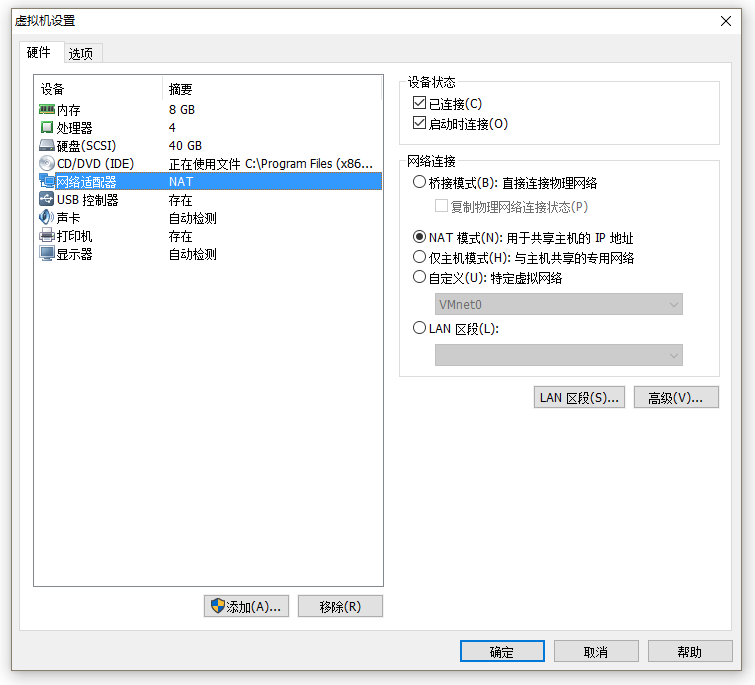
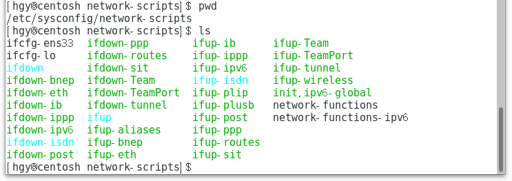

# CentOS 命令行使用笔记
## 切换用户
```
$ su root

$ su hgy

```

## 在 VMware 中的 NAT 网络配置
> 参考资料：http://www.linuxidc.com/Linux/2016-08/133998.htm

1. 在物理机中 `控制面板\网络和 Internet\网络连接` 打开 `VMare Virtual Ethernet Adapter for VMnet8` 属性窗口。（1） 勾选 `Vmware Bridge Protocal` 。（2）双击 `Internet 协议版本 4（TCP/IPv4）` 打开属性窗口设置自动获取 IP。
 

2. 在 VMware 中设置网络连接为 `NAT 模式`。


3. 在 CentOS 终端中进入 `/etc/sysconfig/network-scripts`
```
$ cd /etc/sysconfig/network-scripts
```

4. 在终端输入 `ls` 查找 `ifcfg-e* ` 文件并记住文件名。打开文件，修改使 `BOOTPROTO=dhcp` 、`ONBOOT=yes`。
> 在 CentOS 中使用 vi 修改文件的笔记见 [CentOS-vi.md](./CentOS-vi.md)



5. 在终端输入命令 ` service network restart ` 重启网络连接。


## 检查网络是否可用
```
$ ping www.baidu.com
```

## 下载文件
```
$ wget http://sw.bos.baidu.com/sw-search-sp/software/3756358c42c34/npp_7.5.1_Installer.exe
```

## 删除文件
```
$ rm npp_7.5.1_Installer.exe
```


## 解压文件
> 参考资料：tar 解压 http://www.cnblogs.com/chjw8016/p/5953168.html
> 参考资料：zip 解压 https://www.cnblogs.com/chinareny2k/archive/2010/01/05/1639468.html
```c
// 解压 .tar.gz 文件
tar -xzvf file.tar.gz 
```// 解压 .zip 文件
unzip file.zip
```
