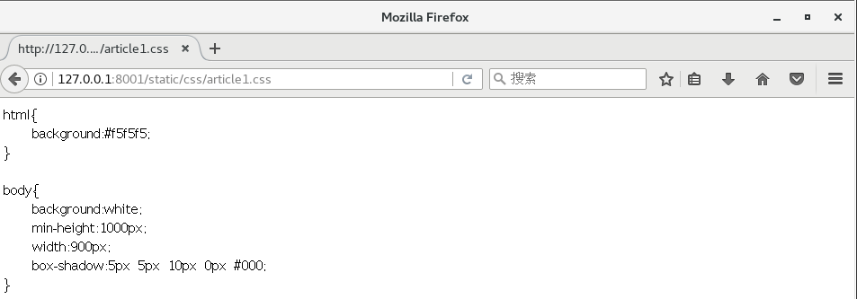

# Django 笔记
>>> - - -  -  - **测试环境操作系统：CentOS 7**

## 简介
> Django 是一个开源的 Web 应用框架，由 Python 写成，初次发布于 2005 年 7 月。Django 采用了 MVC 软件设计模式。

Django 版本和对应的 Python 版本

| Django 版本 | Python 版本|
| ----------- | ---------- |
| 1.8 | 2.7 , 3.3 , 3.4 , 3.5|
| 1.9 , 1.10 | 2.7 , 3.4 ,3.5|
| 1.11 | 2.7 , 3.4 , 3.5 , 3.6 |
| 2.0 | 3.5+ |

> http://www.runoob.com/django/django-tutorial.html


## 创建第一个项目
```c
django-admin.py startproject HelloWorld
```
> 目录结构
>   |-- HelloWorld 项目的容器
>   |   |-- __init__.py  一个空文件，告诉 Python 该目录是一个 Python 包
>   |   |-- settings.py
>   |   |-- urls.py 该 Django 项目的 URL 声明; 一份由 Django 驱动的网站"目录"
>   |   `-- wsgi.py 一个 WSGI 兼容的 Web 服务器的入口，以便运行你的项目
>   `-- manage.py 一个实用的命令行工具，可让你以各种方式与该 Django 项目进行交互

## 运行第一个项目
```
python manage.py runserver 0.0.0.0:8001
```


## 创建第二个项目
> 参考：https://www.cnblogs.com/feixuelove1009/p/5823135.html

1.新建项目
```c
django startproject website2
/* 查看目录结构
[hgy@centosh djangowksp]$ cd website2/
[hgy@centosh website2]$ tree
.
├── manage.py
└── website2
    ├── __init__.py
    ├── settings.py
    ├── urls.py
    └── wsgi.py

*/
```
2.创建 App
```c
/*
在一个 django 项目中可以包含多个 APP，相当于一个大型项目中的分系统、
子模块、功能部件等等，相互之间比较独立，但也有联系。所有的APP共享项目资源。
*/
python manage.py startapp cmdb

/*查看目录结构
[hgy@centosh website2]$ tree
.
├── cmdb
│   ├── admin.py
│   ├── apps.py
│   ├── __init__.py
│   ├── migrations
│   │   └── __init__.py
│   ├── models.py
│   ├── tests.py
│   └── views.py
├── manage.py
└── website2
    ├── __init__.py
    ├── __init__.pyc
    ├── settings.py
    ├── settings.pyc
    ├── urls.py
    └── wsgi.py

*/
```

3. 编写路由
```c
vi website2/urls.py
```
```python
# file urls.py
from django.conf.urls import url
from django.contrib import admin
# 引入cmdb/views.py
from cmdb import views

urlpatterns = [
   # 匹配 index 路径时，调用 view.py 里的 index 函数
    url(r'^index/',views.index),
]

```

4. 编写路由响应
```c
vi cmdb/views.py
```
```python
# file views.py
from django.shortcuts import HttpResponse

def index(request):
    return HttpResponse("Hello,Django")

```
5. 启动服务 并测试
```c
python manage.py runserver 0.0.0.0:8001
```


## 响应一个 HTML 文件
> 参考：https://www.cnblogs.com/feixuelove1009/p/5823135.html

> 之前都是返回的是字符串。
1. templates 下写一个 HTML 文件
```c
vi templates/index.html
```
```html
<!-- file index.html -->
<!DOCTYPE>
<html>
<head>
   <meta charset="utf-8">
   <title>HTML 文件</title>
</head>

<body>
<h1 style="text-align:center;color:blue;">这是浏览器发送请求之后，Django返回的HTML文件</h1>

<body>
</html>

```
```c
// 查看目录结构
/*
[hgy@centosh website2]$ tree
.
├── cmdb
│   ├── admin.py
│   ├── apps.py
│   ├── __init__.py
│   ├── __init__.pyc
│   ├── migrations
│   │   └── __init__.py
│   ├── models.py
│   ├── tests.py
│   ├── views.py
│   └── views.pyc
├── db.sqlite3
├── manage.py
├── templates
│   └── index.html
└── website2
    ├── __init__.py
    ├── __init__.pyc
    ├── settings.py
    ├── settings.pyc
    ├── urls.py
    ├── urls.pyc
    ├── wsgi.py
    └── wsgi.pyc

*/
```
2. 修改 views.py
```c
vi cmdb/views.py
```
```python
# file views.py
#from django.shortcuts import HttpResponse

from django.shortcuts import render

def index(request):
    #return HttpResponse("Hello,Django")
    return render(request,"index.html",)

```
3. 在 website2/settings.py 配置 TEMPLATES 路径
```c
vi websites/settings/py
```
``` python
# file settings.py
...
...
TEMPLATES = [
    {
        'BACKEND': 'django.template.backends.django.DjangoTemplates',
        # 改了 'DIRS' ----- templates 指包含 index.html 的目录
        'DIRS': [os.path.join(BASE_DIR,'templates')],
        'APP_DIRS': True,
        'OPTIONS': {
            'context_processors': [
                'django.template.context_processors.debug',
                'django.template.context_processors.request',
                'django.contrib.auth.context_processors.auth',
                'django.contrib.messages.context_processors.messages',
            ],
        },
    },
]
...
...
```
4. 重启服务 并测试
```c
python manage.py runserver 127.0.0.1:8001
```


## 响应静态文件
1. 新建 static 目录
```c
/*查看文件目录结构
[hgy@centosh website2]$ tree
.
├── cmdb
│   ├── admin.py
│   ├── apps.py
│   ├── __init__.py
│   ├── __init__.pyc
│   ├── migrations
│   │   └── __init__.py
│   ├── models.py
│   ├── tests.py
│   ├── views.py
│   └── views.pyc
├── db.sqlite3
├── manage.py
├── static
│   ├── css
│   ├── images
│   └── js
├── templates
│   └── index.html
└── website2
    ├── __init__.py
    ├── __init__.pyc
    ├── settings.py
    ├── settings.pyc
    ├── urls.py
    ├── urls.pyc
    ├── wsgi.py
    └── wsgi.pyc

*/

```
2. 在 static/css 下面写一个 css 文件
```css
/* file article01.css */
html{
    background:#f5f5f5;
}

body{
    background:white;
    min-height:1000px;
    width:900px;
    box-shadow:5px 5px 10px 0px #000;
}

```


3. 在 website2/settings.py 配置静态文件目录
```python
# file settings.py
...
...
STATIC_URL = '/static/'

STATICFILES_DIRS = (
    os.path.join(BASE_DIR,'static'),
)
...
...
```

4. 重启服务 并测试
```
python manage.py runserver 127.0.0.1:8001
```

