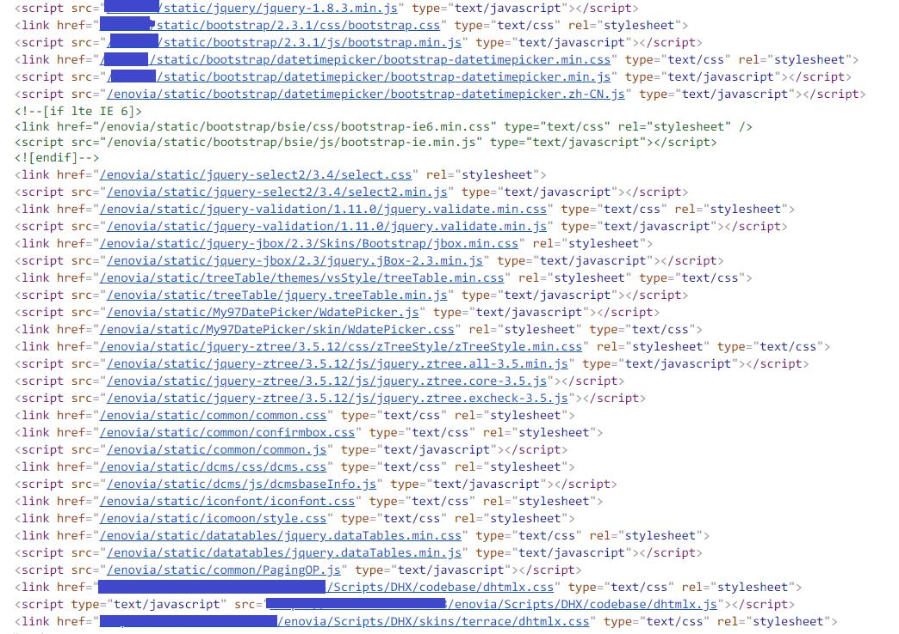

# 信息系统技术选型梳理

## 后端

- 硬件和操作系统
  - 操作系统: `Linux` / `Windows`
  - 带宽
  - 内存
  - CPU
  - 硬盘
  - 网络范围: 内网/外网

- 软件
  - 语言: `Java` / `Python` / `JavaScript` / `PHP` ...以下以 `Java` 为例
  - 数据库管理系统: `MySQL` / `Oracle` ...
  - 持久层框架: `MyBatis` / `Hibernate` ...
  - 消息队列框架: `ActiveMQ` / `Kafka` / `RocketMQ`
  - 缓存: `Redis` / `Memcache` / `Ehcache`
  - 项目构建和依赖管理: `Maven` / `Gradle`
  - 核心框架: `Spring`
  - 工作流: `Activiti`
  - 日志框架: `Log4j`
  - 单元测试: `Junit`
  - 安全: `Shiro`
  - 实时数据处理
  - 大数据搜索: `Elasticsearch`
  - 大数据: `Hbase` / `Hadoop`
  - 负载均衡
  - 备份
  - 集群

## 前端

- UI 小组件
  - 表格
  - 对话框
  - 日历
  - 分页
  - 进度条
  - 弹窗
  - 图片浏览器
  - 轮播
  - 表单控件（输入框、文本框、下拉框、单选、多选、按钮、日期选择框）
  - 下拉搜索
  - 结构树

- 重型功能
  - 各种格式文档预览
  - 视频
  - 音乐

- 数据可视化
  - 流程图
  - 甘特图
  - 图表

- UI 组件库
  - Element
  - Layui
  - Bootstrap
  - Ant Design

- 第三方库的存放
  - CDN
  - 混合

- 技术方案0

  - 业务逻辑（数据计算和 DOM 操作）: `jQuery`
  - UI 组件
    - 日期控件: `jQuery-ui` / `Easy-UI` / `Bootstrap-DateTimePicker` / `dhtmlx(DHX)` / `My97DatePicker`
    - 日历控件: `Kalendae`
    - 表单控件: `Bootstrap` / `Layui`
    - 表格: `Bootstrap` / `Layui`
    - 结构树: `zTree`
    - 进度条: `spin.js`
    - 轮播: `Bootstrap`
    - 弹窗:  `Bootstrap` / `Layui`
    - 下拉搜索: `selectivity`

  - 图表: `Echarts` / `HighCharts`

- 技术方案1
  - 业务逻辑（数据计算和 DOM 操作）: `Vue.js` + `Axios`
  - UI 组件: `Element`
  - 图表: `Echarts`
