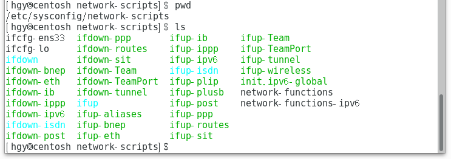

# VMware CentOS 使用笔记

## 在 VMware 中的 NAT 网络配置

> 参考资料：http://www.linuxidc.com/Linux/2016-08/133998.htm

1. 在物理机中 `控制面板\网络和 Internet\网络连接` 打开 `VMare Virtual Ethernet Adapter for VMnet8` 属性窗口。（1） 勾选 `Vmware Bridge Protocal` 。（2）双击 `Internet 协议版本 4（TCP/IPv4）` 打开属性窗口设置自动获取 IP。
 

2. 在 VMware 中设置网络连接为 `NAT 模式`。


3. 在 CentOS 终端中进入 `/etc/sysconfig/network-scripts`
```c
$ cd /etc/sysconfig/network-scripts
```

4. 在终端输入 `ls` 查找 `ifcfg-e* ` 文件并记住文件名。打开文件，修改使 `BOOTPROTO=dhcp` 、`ONBOOT=yes`。



5. 在终端输入命令 ` service network restart ` 重启网络连接。


6. 检查网络是否可用

```c
$ ping www.baidu.com
```


## NAT 网络连接模式下 VMware 物理主机访问 CentOS 虚拟机上的网站

1. 关闭物理主机防火墙。

2. 关闭虚拟机防火墙。

3. 获取虚拟机 ip。

4. 在 WMware 中打开 `编辑 -> 虚拟网络编辑器`。打开 【NAT 设置窗口】。单击【添加】按钮。


5. 输入主机端口、类型（选 TCP）、虚拟机 IP 地址（第 3 步获取到的）、虚拟机端口。

6. 测试。用物理主机浏览器打开 http://localhost:刚才设置的主机端口。
