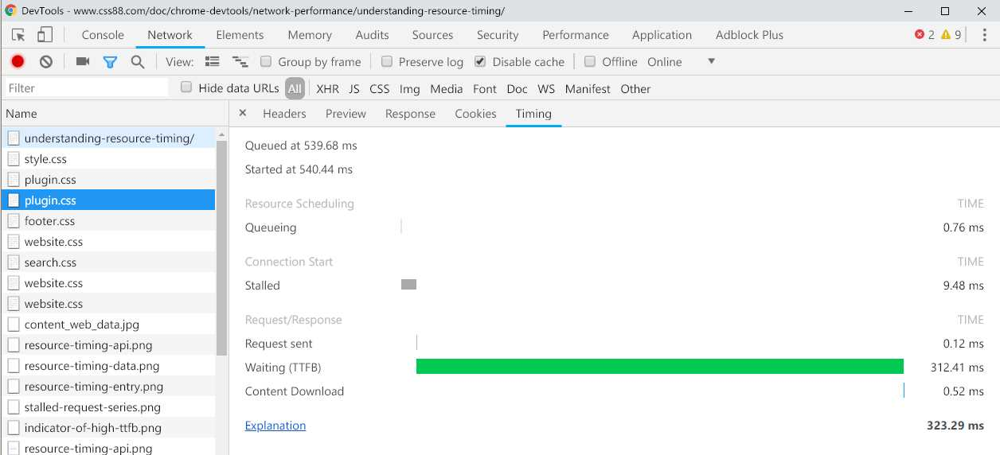

# 使用 Google Chrome 查看网站性能

## Network  =》 Timing 查看资源加载性能

#### Queuing 排队

  * 原因1：该资源浏览器降低优先级，没有立即发送请求，请求被暂时搁置。

  * 原因2：浏览器限制，在HTTP 1协议中，每个源上只能有6个TCP连接，这个请求被暂时搁置。

#### Stalled/Blocking 停止/阻塞

  * 发送请求之前等待的时间。它可能因为进入队列的任意原因而被阻塞。这个时间包括代理协商的时间。另外，如果有已经建立好的连接，那么这个时间还包括等待已建立连接被复用的时间，这个遵循Chrome对同一源最大6个TCP连接的规则。

#### Request Sent / Sending 请求已发送/正在发送

  * 发出网络请求所花费的时间。 通常是几分之一毫秒。

#### Waiting (TTFB) 等待

  * 等待初始响应所花费的时间，也称为`Time To First Byte`(接收到第一个字节所花费的时间)。这个时间除了[等待服务器传递响应所花费的时间]之外，还捕获到服务器发送数据的延迟时间。

####  Content Download / Downloading (内容下载/下载)
  * 接收响应数据所花费的时间：从接收到第一个字节开始，到下载完最后一个字节结束。

### 常见问题

#### 1. 排队或停止阻塞

这表示从单个客户端检索的资源太多。在HTTP 1.0/1.1连接协议中，Chrome限制每个域名最多执行6个TCP连接。如果您一次请求十二个资源，前6个将开始，后6个将排队。一旦其中一个请求完成，队列中的第一个请求项目将开始其请求过程。

要解决传统HTTP 1的此问题，您需要实现分域。即用多个子域名提供服务资源，将资源拆分到多个子域中，均匀分配。

#### 2. 接收到第一个字节的时间（Waiting TTFB）很长

TTFB就是等待第一个响应字节的时间，建议在200ms以下，以下情况可能会导致高TTFB:  

(1) 客户端和服务器之间的网络条件差。

(2) 服务器端程序响应很慢。

为了解决高TTFB，首先去除尽可能多的网络连接。理想情况下，在本地托管应用程序（部署在本地），并查看是否仍有一个大的TTFB。如果有，那么需要优化应用程序针的响应速度。这可能意味着优化数据库查询，为内容的某些部分实现高速缓存，或修改Web服务器配置。后端可能很慢的原因有很多。您需要对您的程序进行研究，并找出不符合您预期的内容。

如果本地TTFB低，那么是您的客户端和服务器之间的网络问题。网络传输可能被很多种事情干扰阻碍。在客户端和服务器之间有很多点，每个都有自己的连接限制，可能会导致问题。测试减少这种情况的最简单的方法是将您的应用程序放在另一台主机上，看看TTFB是否改进。

#### 3. Content Download 加载缓慢

如果看到 Content Download(内容下载)阶段花费了很多时间，提高服务响应速度、并行下载等优化措施帮助都不大。 主要的解决方案是发送更少的字节。（比如，下载一张高质量的大图，可能是几兆，这个时候你需要优化图片。

## 参考资料
【1】[了解资源加载时序 · Chrome 开发者工具中文文档](https://www.css88.com/doc/chrome-devtools/network-performance/understanding-resource-timing/)
【2】[Chrome DevTools 之 Network，网络加载分析利器](https://www.jianshu.com/p/471950517b07)
【3】[Chrome DevTools 之 Timeline，快捷性能优化工具](https://www.jianshu.com/p/b8cdcd9bfad8)
【4】[Chrome DevTools 之 Profiles，深度性能优化必备](https://www.jianshu.com/p/504bde348956)
【5】[再谈前端优化——从实际项目优化说起](https://github.com/creeperyang/blog/issues/14)
【6】[Chrome Network Resource Timing详解](https://github.com/hy-inger/hy-inger.github.io/issues/1)