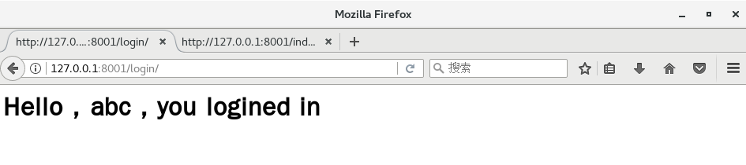

# Django 笔记

>>> - - -  -  - **测试环境操作系统：CentOS 7**

## 简介

> Django 是一个开源的 Web 应用框架，由 Python 写成，初次发布于 2005 年 7 月。Django 采用了 MVC 软件设计模式。

Django 版本和对应的 Python 版本

| Django 版本 | Python 版本|
| ----------- | ---------- |
| 1.8 | 2.7 , 3.3 , 3.4 , 3.5|
| 1.9 , 1.10 | 2.7 , 3.4 ,3.5|
| 1.11 | 2.7 , 3.4 , 3.5 , 3.6 |
| 2.0 | 3.5+ |

> http://www.runoob.com/django/django-tutorial.html


## 创建第一个项目

```c
django-admin.py startproject HelloWorld

```

> 目录结构  
>   |-- HelloWorld 项目的容器  
>   |   |-- __init__.py  一个空文件，告诉 Python 该目录是一个 Python 包  
>   |   |-- settings.py  
>   |   |-- urls.py 该 Django 项目的 URL 声明; 一份由 Django 驱动的网站"目录"  
>   |   `-- wsgi.py 一个 WSGI 兼容的 Web 服务器的入口，以便运行你的项目  
>   `-- manage.py 一个实用的命令行工具，可让你以各种方式与该 Django 项目进行交互

## 运行第一个项目

```
python manage.py runserver 0.0.0.0:8001
```


## 创建第二个项目

> 参考：https://www.cnblogs.com/feixuelove1009/p/5823135.html

1.新建项目
```c
django startproject website2
/* 查看目录结构
[hgy@centosh djangowksp]$ cd website2/
[hgy@centosh website2]$ tree
.
├── manage.py
└── website2
    ├── __init__.py
    ├── settings.py
    ├── urls.py
    └── wsgi.py

*/
```
2.创建 App
```c
/*
在一个 django 项目中可以包含多个 APP，相当于一个大型项目中的分系统、
子模块、功能部件等等，相互之间比较独立，但也有联系。所有的APP共享项目资源。
*/
python manage.py startapp cmdb

/*查看目录结构
[hgy@centosh website2]$ tree
.
├── cmdb
│   ├── admin.py
│   ├── apps.py
│   ├── __init__.py
│   ├── migrations
│   │   └── __init__.py
│   ├── models.py
│   ├── tests.py
│   └── views.py
├── manage.py
└── website2
    ├── __init__.py
    ├── __init__.pyc
    ├── settings.py
    ├── settings.pyc
    ├── urls.py
    └── wsgi.py

*/
```

3. 编写路由

```c
vi website2/urls.py
```

编辑文件 `urls.py`

```python
from django.conf.urls import url
from django.contrib import admin
# 引入cmdb/views.py
from cmdb import views

urlpatterns = [
   # 匹配 index 路径时，调用 view.py 里的 index 函数
    url(r'^index/',views.index),
]

```

4. 编写路由响应

```c
vi cmdb/views.py
```

编辑文件 `views.py`

```python

from django.shortcuts import HttpResponse

def index(request):
    return HttpResponse("Hello,Django")

```

5. 启动服务 并测试

```c
python manage.py runserver 0.0.0.0:8001
```


## 响应一个 HTML 文件

> 之前都是返回的是字符串。

1. templates 下写一个 HTML 文件

```c
vi templates/index.html
```

```html
<!-- file index.html -->
<!DOCTYPE>
<html>
<head>
   <meta charset="utf-8">
   <title>HTML 文件</title>
</head>

<body>
<h1 style="text-align:center;color:blue;">这是浏览器发送请求之后，Django返回的HTML文件</h1>

<body>
</html>

```

```c
// 查看目录结构
/*
[hgy@centosh website2]$ tree
.
├── cmdb
│   ├── admin.py
│   ├── apps.py
│   ├── __init__.py
│   ├── __init__.pyc
│   ├── migrations
│   │   └── __init__.py
│   ├── models.py
│   ├── tests.py
│   ├── views.py
│   └── views.pyc
├── db.sqlite3
├── manage.py
├── templates
│   └── index.html
└── website2
    ├── __init__.py
    ├── __init__.pyc
    ├── settings.py
    ├── settings.pyc
    ├── urls.py
    ├── urls.pyc
    ├── wsgi.py
    └── wsgi.pyc

*/
```
2. 修改 views.py

```c
vi cmdb/views.py
```

编辑文件 `views.py`
```python
#from django.shortcuts import HttpResponse

from django.shortcuts import render

def index(request):
    #return HttpResponse("Hello,Django")
    return render(request,"index.html",)

```
3. 在 website2/settings.py 配置 TEMPLATES 路径

```c
vi websites/settings/py
```

编辑文件 `settings.py`

``` python
...
...
TEMPLATES = [
    {
        'BACKEND': 'django.template.backends.django.DjangoTemplates',
        # 改了 'DIRS' ----- templates 指包含 index.html 的目录
        'DIRS': [os.path.join(BASE_DIR,'templates')],
        'APP_DIRS': True,
        'OPTIONS': {
            'context_processors': [
                'django.template.context_processors.debug',
                'django.template.context_processors.request',
                'django.contrib.auth.context_processors.auth',
                'django.contrib.messages.context_processors.messages',
            ],
        },
    },
]
...
...
```
4. 重启服务 并测试

```c
python manage.py runserver 127.0.0.1:8001
```


## 响应静态文件

1. 新建 static 目录
```c
/*查看文件目录结构
[hgy@centosh website2]$ tree
.
├── cmdb
│   ├── admin.py
│   ├── apps.py
│   ├── __init__.py
│   ├── __init__.pyc
│   ├── migrations
│   │   └── __init__.py
│   ├── models.py
│   ├── tests.py
│   ├── views.py
│   └── views.pyc
├── db.sqlite3
├── manage.py
├── static
│   ├── css
│   ├── images
│   └── js
├── templates
│   └── index.html
└── website2
    ├── __init__.py
    ├── __init__.pyc
    ├── settings.py
    ├── settings.pyc
    ├── urls.py
    ├── urls.pyc
    ├── wsgi.py
    └── wsgi.pyc

*/

```

2. 在 static/css 下面写一个 css 文件

```css
/* file article01.css */
html{
    background:#f5f5f5;
}

body{
    background:white;
    min-height:1000px;
    width:900px;
    box-shadow:5px 5px 10px 0px #000;
}

```


3. 在 website2/settings.py 配置静态文件目录

```python
...
...
STATIC_URL = '/static/'

STATICFILES_DIRS = (
    os.path.join(BASE_DIR,'static'),
)
...
...
```

4. 重启服务 并测试

```
python manage.py runserver 127.0.0.1:8001
```


## 接受用户请求的数据

1. 在 templates 目录编写一个登录页面

```html
<!-- file login.html -->
<!DOCTYPE>
<html>
  <head>
    <meta chartset="utf-8">
    <title>登陆</title>
  </head>

  <body>
    <h1>请输入用户名和密码</h1>
    <form action="/login/" method="post">
      <input type="text" name="username" placeholder="用户名">
      <input type="password" name="password" placeholder="密码">
      <input type="submit" value="提交" >

    </form>

   </body>

</html>
```

2. 修改 cmdb/views.py，设置请求处理

```python
...
...
# 新增的函数
def login(request):
    if request.method == "POST":
        username = request.POST.get("username",None)
        password = request.POST.get("password",None)
        print(username,password)
        if username:
            return HttpResponse("<h1>Hello , "+username+" , you logined in</h1>")
        else:
            return HttpResponse("receivied invalified username")
    else:
        return render(request,"login.html")
...
...

```

3. 修改 website2/urls.py 设置路由

```python
# file urls.py
from django.conf.urls import url
from django.contrib import admin
from cmdb import views

urlpatterns = [
    url(r'^index/',views.index),
    url(r'^$',views.home),
    url(r'^login/',views.login),#新增的路由处理
]

```

4. 编辑 website2/settings.py 关闭 csrf 限制

```python
...
...
MIDDLEWARE_CLASSES = [
    'django.middleware.security.SecurityMiddleware',
    'django.contrib.sessions.middleware.SessionMiddleware',
    'django.middleware.common.CommonMiddleware',
#    'django.middleware.csrf.CsrfViewMiddleware', #注释掉这一行以关闭 scrf 限制
    'django.contrib.auth.middleware.AuthenticationMiddleware',
    'django.contrib.auth.middleware.SessionAuthenticationMiddleware',
    'django.contrib.messages.middleware.MessageMiddleware',
    'django.middleware.clickjacking.XFrameOptionsMiddleware',
]
...
...
```
5. 运行，查看效果





## 用动态页面响应请求--使用模板

1. 修改 cmdb/views.py 使其传递数据给模板

```python
...
...
user_list = [
    {"user":"JK","pwd":"123"},
]

def login(request):
    if request.method == "POST":
        username = request.POST.get("username",None)
        password = request.POST.get("password",None)
        print(username,password)
        if username:
            user_list.append({"user":username,"pwd":password})
            return render(request,"userlist.html",{"data":user_list})
        else:
            return HttpResponse("receivied invalified username")
    else:
        return render(request,"login.html")
...
...

```

2. 在 templates 目录下面写一个模板文件

```html
<!-- file userlist.html -->
<!DOCHTML>
<html>
<head>
  <meta charset="utf-8">
  <title>队友</title>
</head>

<body>
<h1>以下是你的队友（包括你）</h1>
<table border="1">
  <thead>
    <th>用户名</th>
    <th>密码</th>
  </thead>

  <tbody>
     
        <tr>
           <td>{{ line.user }}</td>
           <td>{{ line.pwd }} </td>
        </tr>
     
  </tbody>
</table>
</body>
</html>

```

3. 运行程序，查看效果


## 使用数据库

1. 在 `settings.py` 注册 App
```python
...
...
INSTALLED_APPS = [
    'django.contrib.admin',
    'django.contrib.auth',
    'django.contrib.contenttypes',
    'django.contrib.sessions',
    'django.contrib.messages',
    'django.contrib.staticfiles',
    'cmdb', # 添加 cmdb
]

...
...
```

2. 在 settings.py 配置数据

```python
...
...
# 这里使用默认配置
DATABASES = {
    'default': {
        'ENGINE': 'django.db.backends.sqlite3',
        'NAME': os.path.join(BASE_DIR, 'db.sqlite3'),
    }
}
...
...

3. 编辑 cmdb/models.py 配置数据库表

```python
from __future__ import unicode_literals

from django.db import models

class UserInfo(models.Model):
    user = models.CharField(max_length=32)
    pwd = models.CharField(max_length=32)
```

```c
/*查看此时的文件目录结构
[hgy@centosh website2]$ tree
.
├── cmdb
│   ├── admin.py
│   ├── admin.pyc
│   ├── apps.py
│   ├── __init__.py
│   ├── __init__.pyc
│   ├── migrations
│   │   ├── __init__.py
│   │   └── __init__.pyc
│   ├── models.py
│   ├── models.pyc
│   ├── tests.py
│   ├── views.py
│   └── views.pyc
├── db.sqlite3
├── manage.py
├── static
│   ├── css
│   │   └── article1.css
│   ├── images
│   └── js
├── templates
│   ├── index.html
│   ├── login.html
│   └── userlist.html
└── website2
    ├── __init__.py
    ├── __init__.pyc
    ├── settings.py
    ├── settings.pyc
    ├── urls.py
    ├── urls.pyc
    ├── wsgi.py
    └── wsgi.pyc

*/
```

4. 创建表

```c
[hgy@centosh website2]$ python manage.py makemigrations
/* 输出
Migrations for 'cmdb':
  0001_initial.py:
    - Create model UserInfo
*/
[hgy@centosh website2]$ python manage.py migrate

/* 输出
Operations to perform:
  Apply all migrations: admin, contenttypes, cmdb, auth, sessions
Running migrations:
  Rendering model states... DONE
  Applying contenttypes.0001_initial... OK
  Applying auth.0001_initial... OK
  Applying admin.0001_initial... OK
  Applying admin.0002_logentry_remove_auto_add... OK
  Applying contenttypes.0002_remove_content_type_name... OK
  Applying auth.0002_alter_permission_name_max_length... OK
  Applying auth.0003_alter_user_email_max_length... OK
  Applying auth.0004_alter_user_username_opts... OK
  Applying auth.0005_alter_user_last_login_null... OK
  Applying auth.0006_require_contenttypes_0002... OK
  Applying auth.0007_alter_validators_add_error_messages... OK
  Applying cmdb.0001_initial... OK
  Applying sessions.0001_initial... OK

*/

/* 查看此时的文件目录结构 在 migrations 目录下多了两个文件
[hgy@centosh website2]$ tree
.
├── cmdb
│   ├── admin.py
│   ├── admin.pyc
│   ├── apps.py
│   ├── __init__.py
│   ├── __init__.pyc
│   ├── migrations
│   │   ├── 0001_initial.py
│   │   ├── 0001_initial.pyc
│   │   ├── __init__.py
│   │   └── __init__.pyc
│   ├── models.py
│   ├── models.pyc
│   ├── tests.py
│   ├── views.py
│   └── views.pyc
├── db.sqlite3
├── manage.py
├── static
│   ├── css
│   │   └── article1.css
│   ├── images
│   └── js
├── templates
│   ├── index.html
│   ├── login.html
│   └── userlist.html
└── website2
    ├── __init__.py
    ├── __init__.pyc
    ├── settings.py
    ├── settings.pyc
    ├── urls.py
    ├── urls.pyc
    ├── wsgi.py
    └── wsgi.pyc

*/
```

5. 修改 cmdb/views.py ，使其在收到请求之后将数据写入数据库

```python
...
...
from cmdb import models

def login(request):
    if request.method == "POST":
        username = request.POST.get("username",None)
        password = request.POST.get("password",None)
        print(username,password)
        if username:
            models.UserInfo.objects.create(user=username,pwd=password)
            user_list = models.UserInfo.objects.all()
            return render(request,"userlist.html",{"data":user_list})
        else:
            return HttpResponse("receivied invalified username")       
    else:
        return render(request,"login.html")

...
...

```

6. 运行程序，测试效果


## Django 配置 MySQL 数据库

> 之前使用的是默认的 sqlite
1. 安装 MySQL
具体步骤可参见[CentOS-mysql-note.md](./CentOS-mysql-note.md)

2. 修改 settings.py 中的数据库配置

```python
...
...
DATABASES = {
    'default': {
      # 'ENGINE': 'django.db.backends.sqlite3',
      # 'NAME': os.path.join(BASE_DIR, 'db.sqlite3'),
      'ENGINE':'django.db.backends.mysql',
      'NAME':'test', #数据库名称
      'USER':'root',
      'PASSWORD':'Hgy12345&%',
      'HOST':'localhost',
      'PORT':'3306',
    }
}
...
...

```

3. 创建数据库

```c
// 登录
mysql -u root -p
// 创建数据库
mysql> create database test;
```

4. 创建表

```c
python manage.py makemigrations

python manage.py migrate
```

5. 测试程序，查看效果


```c

mysql use test;
mysql select * from cmdb_userinfo;
// +----+------+--------+
// | id | user | pwd    |
// +----+------+--------+
// |  1 | abf  | afbg   |
// |  2 | jkl; | asdfgh |
// +----+------+--------+

```

## 知识点

> migrate 命令将遍历 INTALLED_APPS 设置中的所有项目，在数据库中建立对应的表，并打印消息。


