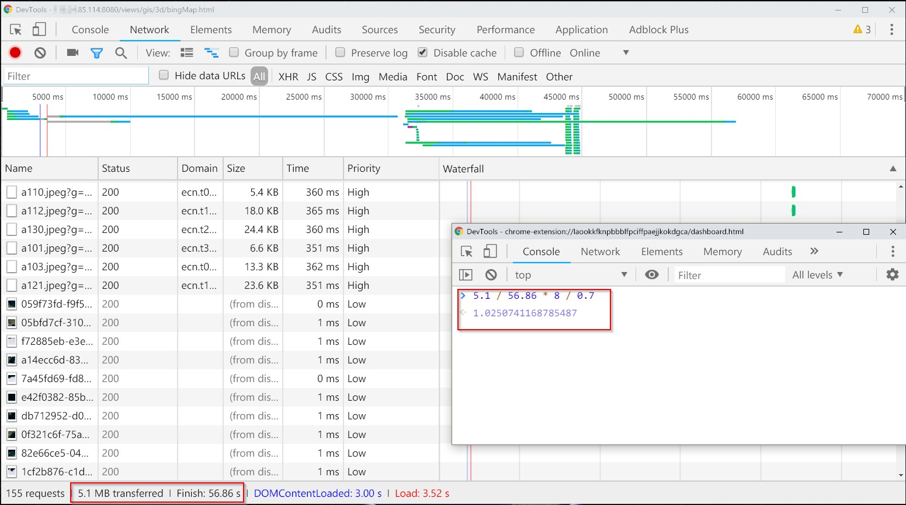

# 网页加载性能优化方法

## 1. HTTP Gzip 压缩传输

> 问题：网络传输大文件（MB级别）的文件传输确实消耗很多时间，即便服务器搭建在本地也慢。

> 观察淘宝、天猫、京东以及各免费 CDN 网站，发现他们都用了 gzip 压缩。


gzip 压缩可以大大提高浏览网站的速度，它的原理是，在客户端请求服务器对应资源后，从服务器端将资源文件压缩，再输出到客户端，由客户端的浏览器负责解压缩并呈现。

### （1）Gzip 压缩简介


* HTTP 协议支持 GZIP 压缩机制，也称协议压缩。 HTTP GZIP压缩是由 Web 服务器和浏览器共同遵守的协议，也就是说WEB服务器和浏览器都必须遵守。目前主流的服务器和浏览器都支持GZIP压缩技术。包括 IE、Chrome、FireFox、Opera 等；服务器有 Nginx, Tomcat、Apache 和 IIS 等。

* GZIP 主要用来压缩 html,css,javascript,等静态文本文件，也支持对动态生成的，包括CGI、PHP , JSP , ASP , Servlet,SHTML等输出的网页也能进行压缩。

* 压缩过程：客户端发送 HTTP 请求，如果请求头(Request Headers)中携带 Accept-Encoding: gzip,deflate (现在的浏览器一般默认都是这样)，那么 Web 服务器在传输响应内容之前，会对响应内容进行压缩，并在响应头中添加Content-Encoding:gzip。

* 解压过程：（浏览器）客户端接收到响应，如果响应头中包含 Content-Encoding:gzip，那么浏览器会自动将响应内容进行 GZIP 解压缩，然后再呈现在页面上。

### （2）Tomcat 配置 Gzip 压缩

修改 tomcat/conf/server.xml，并重启
```xml

<!-- 关键代码：compress*  -->  
<!-- 关键代码：useSendfile="false" 必须要有，否则不生效-->  
<Connector port="8090" protocol="HTTP/1.1"
               connectionTimeout="20000"
               redirectPort="8453"
               executor="tomcatThreadPool"
               enableLookups="false" 
               URIEncoding="utf-8"
			   
               compression="on"
			   compressionMinSize="2048"
			   compressableMimeType="text/html,text/xml,text/plain,text/javascript,application/javascript,application/xml,application/json,application/rjson"
			   useSendfile="false"
			   
               />

<!--  注解：
    compression="on"  // 打开压缩功能 (on|off)
    compressionMinSize="2048" // 启用压缩的输出内容大小，这里面默认为2KB，即文件大于 2KB 才压缩
    compressableMimeType="text/html,text/xml,text/plain,text/css,application/javascript" //对哪些文件类型启用压缩 
-->

```

### （3）Nginx 配置 Gzip 压缩

参考[你真的了解 gzip 吗？](https://zhuanlan.zhihu.com/p/24764131)

### （4） 效果示例

> 测试说明：Tomcat 8 ，部署在本地

* 不使用 Gzip


不使用 Gzip 时传输的 Cesium.js 内容大小为 2.4M ,时间 1.50 秒

* 使用 Gzip


使用 Gzip 时传输的 Cesium.js 内容大小为 911K ,时间 806 毫秒

### （6） 补充说明

* Gzip 压缩需要消耗额外的服务器资源。
* 对于已经压缩过的文件格式如：*.jpg, *.mp3, *.mp4, *.s3m 等，gzip 压缩效果不大，不建议启用压缩。

## 2. 带宽对于资源加载性能的作用

### 常见带宽大小

  * 1Mb 带宽，意味着服务器支持每秒传输的最大文件为 1024 x 1024 bits /8 = 128 KB。
  
  * 5Mb 带宽 ＝＞ 5 x 128KB = 640KB
  
  * 10Mb 带宽 ＝＞ 10 x 128KB = 1280KB

理论上：2M（2Mbps, 即2Mb/s）宽带理论速率是：256KB/s，实际速率大约为150~240KB/s；（其原因是受用户计算机性能、网络设备质量、资源使用情况、网络高峰期、网站服务能力、线路衰耗，信号衰减等多因素的影响而造成的）

带宽下载速率对照表：来源[百度文库](https://wenku.baidu.com/view/1061bdb92cc58bd63186bd80.html)


### 高带宽的作用

  * 提升资源加载速度

  * 决定网站能同时为多少用户提供服务。通常服务器的带宽是固定不变的，所以访问（下载）资源的人数增加时，每个人能得到的带宽（下载速度）将变小，甚至可能把服务器拖垮。所以很多的服务器会有用户人数限制、下载速度限制。

若一个系统网页资源平均大小为 100KB，系统服务器带宽为 5Mb ，网页响应时间要求为 20 秒，则系统可以同时供大约 (5x 1024bits/ 8)KB x 20 / 100 KB = 128 人访问。


### 服务器带宽需求评估

  * 一种计算方法：所需带宽 == 每秒钟下载文件的 MB 数 × 8 / 0.7= 宽带的速率(单位: Mb) 

若三维 GIS 网页完全加载需要加载模型资源 150MB，要求 2 分钟加载完，则下载速率是 150 MB /(2 x 60) ，下载速度超过 1M/s。粗略算作 1M，则所需带宽为 1 x 8 / 0.7 ，大约 10 M。

观察我们一个 DEMO 系统，加载完网页用 16.98 秒，加载了 8.7 MB资源，则下载速度是 8.7/ 18.98 = 0.512 MB/s。 带宽为 0.512 x 8 / 0.7 == 5 Mb。

#### 尝试根据浏览器加载资源情况计算带宽

> 说明：这些网站加载的资源来源都不止一个，计算仅供参考

* 某 10Mb 服务器测试效果


* 某 5Mb 服务器测试效果


* 某 1Mb 服务器测试效果



##### 说明
可以发现这些计算结果跟服务器带宽是有一定关系的。但是如果系统同时有多个人访问，这种计算方式就参考价值就不太大了。

## 参考资料
【1】[Tomcat启用GZIP压缩，提升web性能](http://www.cnblogs.com/DDgougou/p/8675504.html)

【2】[Tomcat8使用gzip压缩JS,CSS文件](https://www.cnblogs.com/imaxue/p/6867324.html)

【3】[如何预估服务器带宽需求](http://www.cnblogs.com/jpfss/p/9455808.html)

【4】[服务器带宽如何估算和选择?](http://www.enkj.com/service/answer/1037)

【5】[云服务器网络带宽需要多大，如何计算？](http://www.laogeng.net/6054.html)

【6】[服务器1M带宽同时能承受多少人在线](http://lusongsong.com/reed/1396.html)