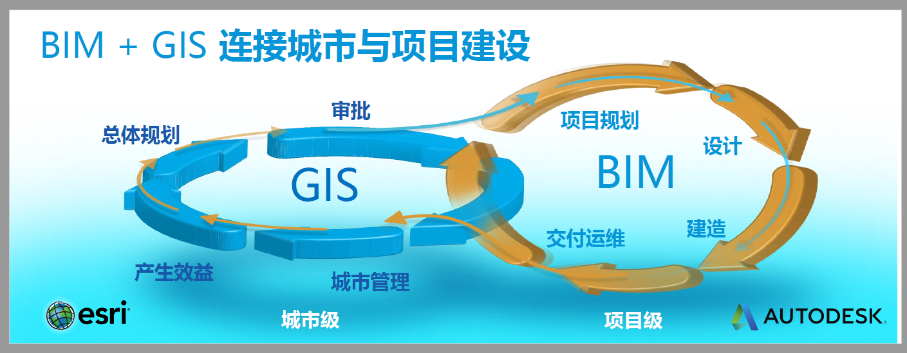
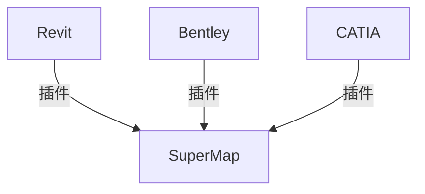
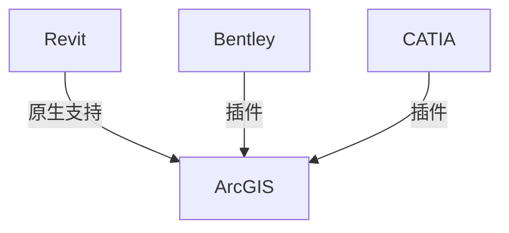

# BIM + GIS 笔记

## 概念

- **BIM** ：Building Information Modeling。建筑信息模型。是建筑学、工程学及土木工程的新工具。

> BIM 是 Autodesk 公司在 2002 年率先提出，目前已经在全球范围内得到业界的广泛认可。BIM 技术是一种应用于工程设计、建造、管理的数据化工具，通过对建筑的数据化、信息化模型整合，在项目策划、运行和维护的全生命周期过程中进行共享和传递，使工程技术人员对各种建筑信息作出正确理解和高效应对，为设计团队以及包括建筑、运营单位在内的各方建设主体提供协同工作的基础。

> 这里引用美国国家BIM标准(NBIMS)对BIM的定义，定义由三部分组成：
> (1)BIM是一个设施(建设项目)物理和功能特性的数字表达；
> (2)BIM是一个共享的知识资源，是一个分享有关这个设施的信息，为该设施从概念到拆除的全生命周期中的所有决策提供可靠依据的过程；
> (3)在设施的不同阶段，不同利益相关方通过在BIM中插入、提取、更新和修改信息，以支持和反映其各自职责的协同作业。

**BIM的特点**  : 可视化、协同（共享）、模拟

- **GIS** : Geographic Information System（地理信息系统）的简称。是一种在计算机硬、软件系统支持下，对整个或部分地球表层（包括大气层）空间中的有关地理分布数据进行采集、储存、管理、运算、分析、显示和描述的技术系统。

- **BIM+GIS**
GIS 的呈现效果一般是抽象而且宏观的（在哪里，有什么，周围有什么，距离多远），而 BIM 是具体且微观的（是什么，长什么样子，尺寸？材质？）。BIM+GIS 意图实现宏观和微观的整合。

## 一些解释

来源：第十六届 Esri 中国用户大会 《BIM+GIS技术专题》

## GIS BIM 平台合作

- Esri + Autodesk

- SuperMap + Dassault Systemes

## 数据整合方案

## 相关数据标准

- i3s
- s3m

## 参考资料

【1】百度百科

