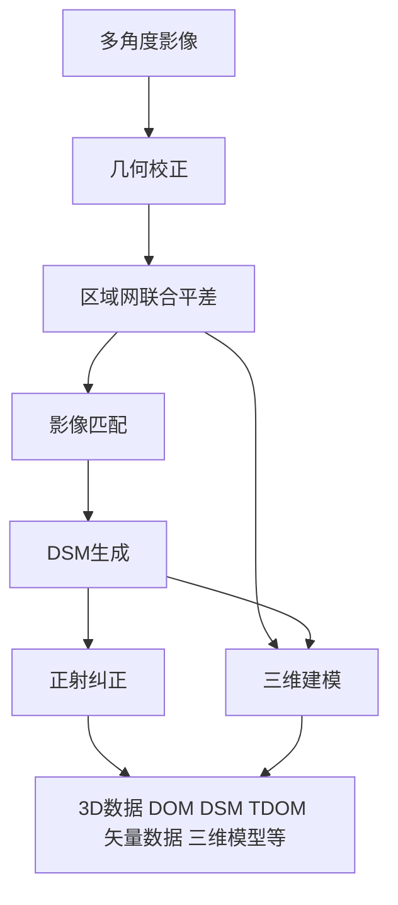
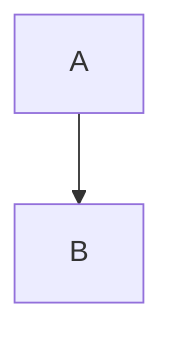
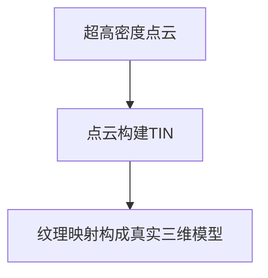

# 倾斜摄影资料查阅笔记

**倾斜摄影（oblique image）**

**倾斜摄影建模** 多角度航拍带有倾斜角的影像，然后通过专业的建模处理软件，全自动的生成模型的过程。

## 倾斜摄影测量技术的一般处理流程

**超高密度点云** 自动化软件一般经过几何校正、联合平差等处理流程可运算生成基于真实影像的超高密度点云，并以此生成基于真实影像纹理的高分辨率实景三维模型。

## 常见的倾斜摄影数据处理软件

**CC** 法国的 Acute3D 公司的 Smart3D Capture。可运算生成基于真实影像的超高密度点云，能无需人工干涉地生成三维场景模型。2011 年创立，2015 年被 Bentley 收购。

**Pix4D** 法国 INFOTERRA 公司的像素（Pixel Factory）StreetFactory 通过对影像进行几何处理、多视匹配、三角网构件，提取典型地物的纹理特征，并对纹理进行可视化处理，最终得到三维模型。

**PhotoScan** 主要用来辅助空三处理，也可以生成DOM和DSM

**EPS** 用来生成垂直摄影模型或导入倾斜摄影模型绘制DLG

> DSM 只记录最高点的高程信息，在房屋建筑密集区域，这种作业方式视觉效果会比较差，在野外地形等地物高程不复杂的区域，这种方式的作业效果不输于倾斜摄影。

