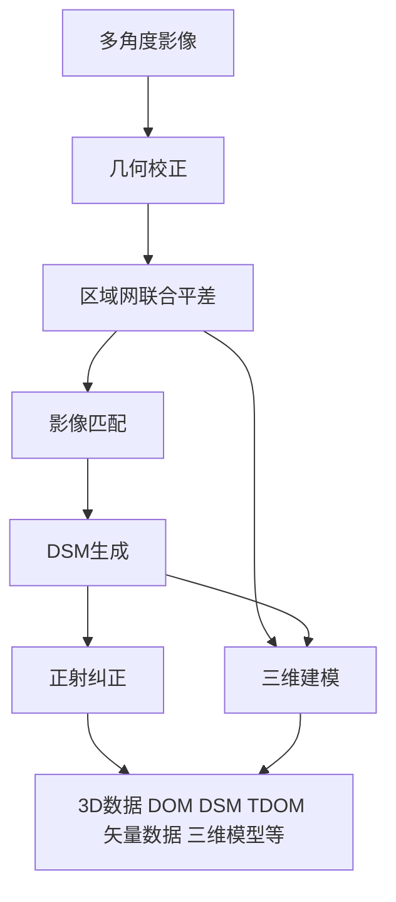
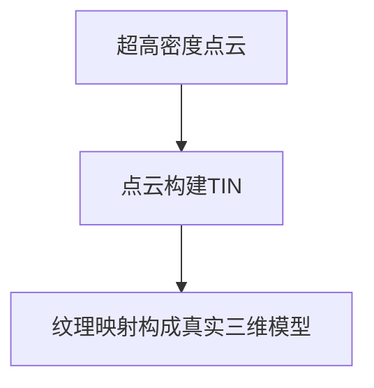
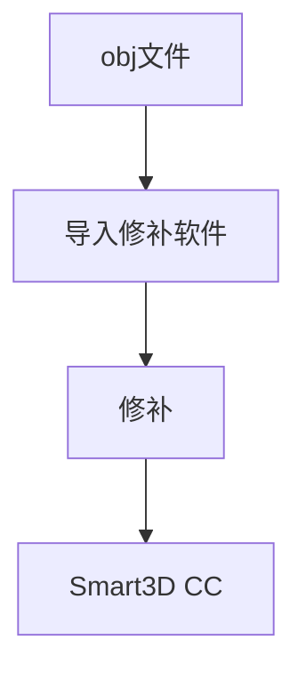

# 倾斜摄影资料查阅笔记

**倾斜摄影（oblique image）**

> **倾斜摄影建模** 多角度航拍带有倾斜角的影像，然后通过专业的建模处理软件，全自动的生成模型的过程。

> 无人机通过在同一飞行平台上搭载多台传感器，可同时从一个垂直和四个倾斜等五个不同的角度采集影像，利用倾斜摄影技术，实现建筑物的正射影像与其立面纹理的倾斜影像相结合进行高效、快速的三维建模，能够有效地降低三维建模的成本。

- **缺点** 
> 这种建模方式具有数据量大、影像倾角大、摄影死角和模型成果数据量大等一些特点。这就造成了在建模过程中常会出现运算速度慢、空三失败、模型修正困难和数据应用困难等问题。

- **和手工建模对比**

| 指标 | 手工建模 | 倾斜摄影 |
| ------ | ------ | ------ |
| 精度 | 可控 | 一般 |
| 效果 | 精致、更主观 | 细部可能粗糙、客观、真实 |
| 数据呈现范围 | 只呈现关键物体 | 可呈现所有物体 |
| 数据类型 | 点、线、面 | DSM + 影像 |
| 制作周期 | 长 | 短 |
| 制作成本 | 高 | 低 |

## 倾斜摄影测量技术的一般处理流程

> **超高密度点云** 自动化软件一般经过几何校正、联合平差等处理流程可运算生成基于真实影像的超高密度点云，并以此生成基于真实影像纹理的高分辨率实景三维模型。

## 常见的倾斜摄影数据处理软件

**CC** 法国的 Acute3D 公司的 Smart3D Capture。可运算生成基于真实影像的超高密度点云，能无需人工干涉地生成三维场景模型。2011 年创立，2015 年被 Bentley 收购。

**Pix4D** 法国 INFOTERRA 公司的像素（Pixel Factory）StreetFactory 通过对影像进行几何处理、多视匹配、三角网构件，提取典型地物的纹理特征，并对纹理进行可视化处理，最终得到三维模型。

**PhotoScan** 主要用来辅助空三处理，也可以生成DOM和DSM

**EPS** 用来生成垂直摄影模型或导入倾斜摄影模型绘制DLG

## 倾斜模型修补软件

受到航摄盲区造成的死角导致三维模型会存在无三角网的空洞区域,尤其是水面区域；空三阶段，因像片及POS参数的质量问题，会出现匹配错误以及点位不足等情况，导致三维模型的空洞；还有三维场景中有悬浮的石头和树木……这些问题都需要我们自己去手动修补优化。

常规的处理有补洞、拉平、删除。

* **Autodesk 3ds Max**  
* **Geomagics**
* **Meshmixer**
* **PhotoMesh**
* **ＲealityPaint** 

## 倾斜摄影模型文件格式

- **obj** : 由Alias|Wavefront公司为3D建模和动画软件"Advanced Visualizer"开发的一种标准，适合用于3D软件模型之间的互导

- **osg(osgb)** : 全称为 Open Scene Graph Binary。这个格式的文件小而多，一般不会直接打开，而是通过索引文件加载。obj 文件一般包括三个子文件，分别是 \*.obj、\*.mtl、\*.jpg。

- **fbx** : FBX 是 FilmBoX 这套软件所使用的格式，后改称 Motionbuilder。

## 各平台对倾斜摄影模型大小的支持

> SuperMap 300 GB 400 平方公里
> ————《超图倾斜摄影解决方案（技术白皮书）》

## 相关功能

- 压平模型：局部切除

- 地形修改

- 添加物体：添加BIM、添加特效物体

- 布尔运算：切除、贴合BIM、填挖方

- 单体化：实现选中单个物体

- 查询：模型查属性、属性查模型、缓冲区查询

> DSM 只记录最高点的高程信息，在房屋建筑密集区域，这种作业方式视觉效果会比较差，在野外地形等地物高程不复杂的区域，这种方式的作业效果不输于倾斜摄影。

## 参考资料
【1】 超图倾斜摄影解决方案（技术白皮书）
【2】浅谈几个倾斜摄影三维模型的修补软件 . https://www.cnblogs.com/Wish3D/p/6404389.html
【3】基于Smart3D的低空无人机倾斜摄影实景三维建模研究 . https://mp.weixin.qq.com/s/hEp5d2Pak3WzODoN0250UQ